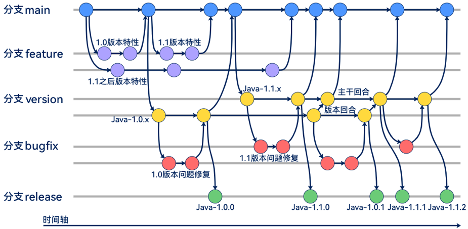

# 开发者指导手册

## 简介

本指导手册旨在为当前项目的开发者提供一份详细的开发指导，包括分支管理、标签管理、提交规则、代码审查等内容。遵循这些指导有助于项目的高效开发和良好协作。

## 开发模式

我们使用 [Git](https://git-scm.com/) 作为版本控制工具，项目开发模式遵从下图所示的多版本的 `Git-Flow` 模式：



- `main` 分支为主干开发分支，所有特性都从该分支检出并合入；
- `{$module}-feature-*` 分支为指定模块的特性开发分支；
- `{$module}-{$majorVersion}.{$minorVersion}.x` 为指定模块的指定版本分支；
- `{$module}-bugfix-*` 分支为指定模块的问题修复分支；
- 所有问题修复或者功能增强，均需要找到对应模块合适的最低版本分支进行处理，然后逐级分支往上合入，最终合入 `main` 分支；
- 适时需要从版本分支上检出合适的分支进行版本发布。

## 环境配置

请参考项目的`README.md`文件以获取关于如何配置开发环境的指导。

## 分支管理

- 为每个功能或问题修复创建一个新的分支，避免在主分支（如 `main`）上直接开发。
- 分支命名应简洁明了，描述分支的主要目的。
  - 不同模块的分支使用不同的前缀。例如：FIT 编程框架以 `fit-` 开头，流程引擎以 `waterflow-` 开头等。
  - 不同功能的分支使用不同的二级前缀。例如：特性分支以 `*-feature-` 开头，功能增强分支以 `*-enhancement-` 开头，任务型分支以 `*-task-` 开头，问题修复分支以 `*-bugfix-` 开头。
  - 使用短划线 `-` 来分隔单词。例如：`fit-feature-new-widget` 或 `builder-bugfix-login-bug`。
  - 版本分支最后跟两个版本号和一个 `x` 字母，版本号分别为主版本号和次版本号，`x` 代表该主版本下的次版本的所有修订版本都在该版本分支上，例如：`fit-java-1.0.x`、`waterflow-python-2.1.x`。
  - 发布分支和版本分支仅最后一位不同，后面跟三个版本号，版本号分别为主版本号、次版本号和修订版本号，例如：`fit-java-1.0.0`、`waterflow-python-2.1.1`。

### 版本分支合并规则

- 版本分支合并必须遵循低版本向高版本合并的原则，且不可跨越某一个版本。
- 当任意 `feature`、`enhancement` 或 `bugfix` 合入指定版本分支之后，从合入的版本分支开始，需要依次向上一个版本分支合并，直到 `main` 分支为止。

## 标签管理

- 每个标签的名字和发布分支的名字需要保持一致。例如：`fit-java-1.0.0`、`waterflow-2.1.1`。
- 候选版本以特殊词组结尾，后面可以跟若干数字代表序号。例如：`fit-java-1.0.0-alpha1` 或 `waterflow-python-2.0.0-beta2`。
- 当标签被打出后，对应的发布分支应当删除，`Git-Flow` 模式下的 `*-main` 分支除外。

## 开发规范

### 版权信息

- 在 `IntelliJ IDEA` 开发环境中，点击 `Settings...`，在 `Copyright Profiles` 中添加一份 `Local Profile`，内容如下：

``` text
Copyright (c) $originalComment.match("Copyright \(c\) (\d+)", 1, "-")$today.year Huawei Technologies Co., Ltd. All rights reserved.
This file is a part of the ModelEngine Project.
Licensed under the MIT License. See License.txt in the project root for license information.
```

- 在其上一级菜单的 `Copyright` 中添加针对 `All Changed Files` 范围的修改，选中刚刚添加的 `Profile`。
- 可以添加自己熟悉的快捷键，以便在每次提交前全局修改所有被修改的文件的版权头信息。例如，我选择的快捷键是：`Command + \`。

### 注释信息

- 每一个类文件都需要注释，包括作者和创建时间：
  - 作者需要添加 `@author {$authorName}`，对于后续的修改者，请在原来的作者下面添加一行新的信息；
  - 创建时间为该类的创建日期，格式是 `@since yyyy-MM-dd`，一旦文件被创建，该时间不可修改。
- 所有被 `public` 和 `protected` 修饰的类、方法、字段等都需要添加注释，注释风格请参考当前项目中已有的文件：
  - 所有 `@param` 和 `@return` 的注释，最后都需要根据其类型添加引用，基本类型需要添加 `{@code }` 标记，其他需要添加 `{@link }` 标记。
  - 所有半角字符和全角字符之间需要增加一个空格，来使得整体排版规整，方便超长内容的换行。

## 提交规则

### 本地提交配置

- 在 `.git/hooks/` 目录下，修改 `pre-commit.sample` 的文件名为 `pre-commit`，确保在本地提交代码时进行本地提交检查。
- 继续修改 `pre-commit` 文件，在该文件的最开始注释之后加上以下两行，使本地代码提交前，进行待提交文本的编码检查，确保文本文件都是 `UTF-8` 编码。

``` bash
# Check for files that are not UTF-8 or ASCII encoded
exec git-hooks/check-utf8-encoding.sh
```

> 注意，需要确保`git-hooks/`目录下的所有脚本都有可执行的权限，请在本地执行以下命令：
> `chmod +x git-hooks/check-utf8-encoding.sh`

### 提交信息格式

- 以中括号开头，然后加上模块名，例如 `[fit]`。
- 用简短的语句描述提交的主要内容，不要太长，建议 20 个字以内，需要使用中文，结尾不需要句号。
- 如有必要，在简短的描述后添加一个空行，然后补充详细说明，可以使用多行来描述。
- 说明中可以包括问题的原因、解决方法和影响范围等。
- 样例：`[fit] 修复某问题`。

## 代码审查

- 开发完成后，通过创建合并请求将变更合并到主分支。在合并请求中描述所做的更改，并邀请其他项目成员进行代码审查。
- 保持主分支始终可部署，确保合并的代码经过充分测试，遵循项目的代码规范。

## 测试

请确保为您的代码编写适当的单元测试和集成测试，并在提交前运行测试以确保一切正常。

## 发布流程

遵循项目的发布计划和流程。在发布新版本时，请按照标签管理的规定创建一个新的 `tag`。

## 问题和需求跟踪

使用项目的 `Issue` 跟踪器来报告和跟踪问题、需求和功能建议。在创建新 `Issue` 时，请尽量提供详细的信息，以便其他参与者能够更好地理解问题或需求，项目开发核心成员会定期审视 `Issue` 列表，并进行归类。

## 贡献指南

对于希望参与项目的贡献者，请遵循以下步骤：

1. Fork 当前项目。
2. 克隆 Fork 后的仓库到本地。
3. 在本地仓库中创建一个新的分支，进行开发。
4. 遵循本文档中的提交规范，将更改提交到新分支。
5. 通过页面创建一个 PR，请求将更改合并到该项目的对应分支，PR 中仅能包含一次提交。
6. 参与代码审查和讨论，根据反馈进行必要的修改。
7. 一旦更改被接受并合并，您的贡献将成为项目的一部分。

> - 请注意，项目维护者可能会提出对您的贡献进行修改或调整的建议。请保持开放的态度，与项目维护者保持积极沟通，以确保您的贡献符合项目的目标和标准。
> - 如果您发现了一个问题或优化点，但并不准备自己进行修复或改造，您可以仅提交一个 Issue。但如果您想自己动手解决，您可以直接提交一个 PR。如果对于方案存在疑问，可以在“讨论”模块中进行提问，以广泛收集意见，项目维护者会定期审视。
