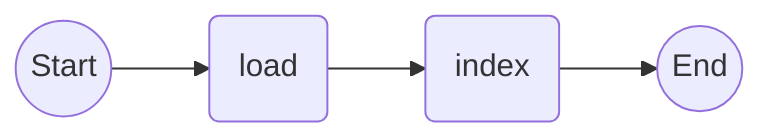
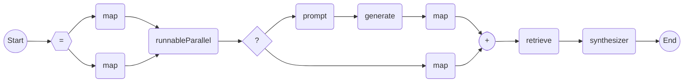
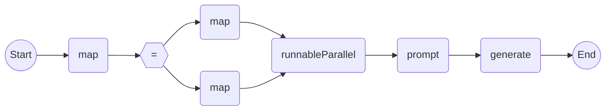

## 简介

随着大型语言模型的火爆，在其之上构建的应用与日俱增。然而在一些垂直应用领域中，大模型的实际表现往往不如预期，这是因为大模型的知识存储在模型参数中，导致模型不了解训练集之外的知识。因此如何构建一个垂直领域知识的大模型应用，成为业界的难题。

检索增强生成（​RAG）即将检索的能力集成到 LLM 文本生成中。它结合了检索系统（从大型语料库中获取相关文档片段）和 LLM （使用这些片段中的信息生成答案）。引入 RAG 的作用如下：

1. 帮助模型解决/缓解知识密集型任务下的幻觉问题。 一些场景，哪怕强如 GPT4，也会编造答案，给用户带来极大的信任危机。通过引入外部知识，可以限制模型在 Reference 范围内生成答案，从而缓解模型的环境问题。
2. 帮助模型回答实事。大模型语料的收集、预处理以及训练是一个非实时流程，通常极其耗费时间，RAG 可以帮助模型有效更新语料，与时俱进。

随着 RAG 技术的进一步发展和演变，新的技术突破了传统的检索 - 生成框架，基于此催生了模块化 RAG 的概念。在结构上它更加自由的和灵活，引入了更多的具体功能模块，例如查询搜索引擎、融合多个回答。技术上将检索与微调、强化学习等技术融合。流程上也对 RAG 模块之间进行设计和编排，出现了多种的 RAG 模式，即模块化 RAG。

- 针对数据入库阶段，抽象出以下算子：

```java
@FunctionalInterface
public interface Source<I> extends Pattern<I, List<Document>> {
    /**
     * 根据输入参数加载文档。
     *
     * @param input 表示输入参数的 {@link I}。
     * @return 表示加载文档列表的 {@link List}{@code <}{@link Document}{@code >}。
     */
    List<Document> load(I input);
}

@FunctionalInterface
public interface Splitter<D> extends Pattern<D, List<D>> {
    /**
     * 将输入数据进入切分。
     *
     * @param data 表示输入数据的 {@link D}。
     * @return 表示切分完毕数据列表的 {@link List}{@code <}{@link D}{@code >}。
     */
    List<D> split(D data);
}

public interface Store<D> extends Pattern<D, Void> {
    /**
     * 添加数据到存储中。
     *
     * @param data 表示待添加数据的 {@link D>}。
     */
    void persistent(D data);
}
```

- 检索阶段，抽象出以下算子：

```java
public interface Retriever<I, O extends Measurable> extends Pattern<I, List<O>> {
    /**
     * 根据用户输入进行检索。
     *
     * @param query 表示用户输入的 {@link I}。
     * @return 返回可量化数据的 {@link List}{@code <}{@link O}{@code >}。
     */
    List<O> retrieve(I query);
}

public interface PostProcessor<D> extends Pattern<D, D> {
    /**
     * 对检索结果进行后处理。
     *
     * @param data 表示输入数据的 {@link D}。
     * @return 表示处理后数据的 {@link D>}。
     */
    D process(D data);
    }
}

public interface Synthesizer<I> extends Pattern<I, Content> {
    /**
     * 将检索的数据进行合成。
     *
     * @param input 表示检索数据的 {@link I}。
     * @return 表示合成结果的 {@link Content}。
     */
    Content synthesize(I input);
}
```

用户通过灵活组合各个算子，即可快速搭建属于自己业务的 RAG 应用。

## 示例

接下来，将演示如何快速搭建一个 native RAG 应用，从本章开始我们将使用 FEL Flow 进行应用编排。

1. 在项目 pom.xml 加入以下依赖：

```xml
<dependencies>
    <dependency>
        <groupId>modelengine.fit.starter</groupId>
        <artifactId>fit-starter</artifactId>
        <version>${fit.version}</version>
    </dependency>
    <dependency>
        <groupId>modelengine.fit.starter</groupId>
        <artifactId>fit-plugins-starter-web</artifactId>
        <version>${fit.version}</version>
    </dependency>
    <dependency>
        <groupId>modelengine.fit.plugin</groupId>
        <artifactId>fit-http-client-okhttp</artifactId>
        <version>${fit.version}</version>
    </dependency>
    <dependency>
        <groupId>modelengine.fit.jade.fel</groupId>
        <artifactId>fel-core</artifactId>
        <version>${fel.version}</version>
    </dependency>
    <dependency>
        <groupId>modelengine.fit.jade.fel</groupId>
        <artifactId>fel-flow</artifactId>
        <version>${fel.version}</version>
    </dependency>
    <dependency>
        <groupId>modelengine.fit.jade.community</groupId>
        <artifactId>fel-model-openai-plugin</artifactId>
        <version>${fel.version}</version>
    </dependency>
</dependencies>
```

2. 在 application.yml 配置文件中加入以下配置：

```yaml
fel:
  openai:
    api-base: '${api-base}'
    api-key: '${your-api-key}'
example:
  model:
    chat: '${model-name}'
    embed: '${model-name}'
```

3. 添加以下代码：

```java
@Component
@RequestMapping("/ai/example")
public class RetrievalExampleController {
    private static final String REWRITE_PROMPT =
            "作为一个向量检索助手，你的任务是结合历史记录，为”原问题“生成”检索词“，" + "生成的问题要求指向对象清晰明确，并与“原问题语言相同。\n\n"
                    + "历史记录：\n---\n" + DEFAULT_HISTORY_KEY + "---\n原问题：{{query}}\n检索词：";
    private static final String CHAT_PROMPT = "Answer the question based on the context below. "
            + "If the question cannot be answered using the information provided answer with \"I don't know\".\n\n"
            + "Context: {{context}}\n\n" + "Question: {{query}}\n\n" + "Answer: ";
    private final AiProcessFlow<String, ChatMessage> ragFlow;
    private final Memory memory = new CacheMemory();

    public RetrievalExampleController(ChatModel chatModel, EmbedModel embedModel, ObjectSerializer serializer,
            @Value("${example.model.chat}") String chatModelName,
            @Value("${example.model.embed}") String embedModelName) {
        DocumentEmbedModel documentEmbedModel =
                new DefaultDocumentEmbedModel(embedModel, EmbedOption.custom().model(embedModelName).build());
        VectorStore vectorStore = new MemoryVectorStore(documentEmbedModel);
        ChatFlowModel chatFlowModel =
                new ChatFlowModel(chatModel, ChatOption.custom().model(chatModelName).stream(false).build());

        AiProcessFlow<Tip, Content> retrieveFlow = AiFlows.<Tip>create()
                .runnableParallel(history(), passThrough())
                .conditions()
                .match(tip -> !tip.freeze().get(DEFAULT_HISTORY_KEY).text().isEmpty(),
                        node -> node.prompt(Prompts.human(REWRITE_PROMPT))
                                .generate(chatFlowModel)
                                .map(ChatMessage::text))
                .others(node -> node.map(tip -> tip.freeze().get("query").text()))
                .retrieve(new DefaultVectorRetriever(vectorStore, SearchOption.custom().topK(1).build()))
                .synthesize(docs -> Content.from(docs.stream().map(Document::text).collect(Collectors.joining("\n\n"))))
                .close();

        AiProcessFlow<File, List<Document>> indexFlow = AiFlows.<File>create()
                .load(new JsonFileSource(serializer, StringTemplate.create("{{question}}: {{answer}}")))
                .index(vectorStore)
                .close();
        File file = FileUtils.file(this.getClass().getClassLoader().getResource("data.json"));
        notNull(file, "The data cannot be null.");
        indexFlow.converse().offer(file);

        this.ragFlow = AiFlows.<String>create()
                .map(query -> Tip.from("query", query))
                .runnableParallel(value("context", retrieveFlow), passThrough())
                .prompt(Prompts.history(), Prompts.human(CHAT_PROMPT))
                .generate(chatFlowModel)
                .close();
    }

    /**
     * 聊天接口。
     *
     * @param query 表示用户输入查询的 {@link String}。
     * @return 表示聊天模型生成的回复的 {@link ChatMessage}。
     */
    @GetMapping("/chat")
    public ChatMessage chat(@RequestParam("query") String query) {
        ChatMessage aiMessage = this.ragFlow.converse().offer(query).await();
        this.memory.add(new HumanMessage(query));
        this.memory.add(aiMessage);
        return aiMessage;
    }
}
```

其中：

- 定义预料入库流程

```java
DocumentEmbedModel documentEmbedModel =
        new DefaultDocumentEmbedModel(embedModel, EmbedOption.custom().model(embedModelName).build());
AiProcessFlow<File, List<Document>> indexFlow = AiFlows.<File>create()
                .load(new JsonFileSource(serializer, StringTemplate.create("{{question}}: {{answer}}")))
                .index(vectorStore)
                .close();
```

流程接收一个 `Json File`，解析后生成文档并存在到向量数据库中。



- 定义知识检索流程

```java
AiProcessFlow<Tip, Content> retrieveFlow = AiFlows.<Tip>create()
        .runnableParallel(history(), passThrough())
        .conditions()
        .match(tip -> !tip.freeze().get(DEFAULT_HISTORY_KEY).text().isEmpty(),
        node -> node.prompt(Prompts.human(REWRITE_PROMPT))
        .generate(chatFlowModel)
        .map(ChatMessage::text))
        .others(node -> node.map(tip -> tip.freeze().get("query").text()))
        .retrieve(new DefaultVectorRetriever(vectorStore, SearchOption.custom().topK(1).build()))
        .synthesize(docs -> Content.from(docs.stream().map(Document::text).collect(Collectors.joining("\n\n"))))
        .close();
```

流程接收一个 `Tip` 对象，首先根据问题和历史记录，对原问题进行重写，再从向量数据库中检索出相关知识并返回。



- 定义 RAG 主流程

```java
AiProcessFlow<String, ChatMessage> ragFlow = AiFlows.<String>create()
      .map(query -> Tip.from("query", query))
      .runnableParallel(value("context", retrieveFlow), passThrough())
      .prompt(Prompts.history(), Prompts.human(CHAT_PROMPT))
      .generate(chatFlowModel)
      .close();
```

主流程首先进行知识检索，然后根据检索到的知识组装提示词，最后生成答案。



## 验证

- 在浏览器栏输入：`http://localhost:8080/ai/example/chat?query=请介绍一下黑神话悟空`

  返回如下响应：

```json
{
  "content": "《黑神话：悟空》是一款基于《西游记》故事之后的故事情节的游戏。在故事中，孙悟空成佛后不愿受到拘束，辞去佛位，欲回到花果山逍遥快活，但遭到天庭猜忌。二郎神、四大天王、巨灵神率领天兵天将再次杀奔花果山。在与二郎神的激战中，孙悟空被重新出现的紧箍咒所困，最终不敌二郎神，肉身残躯化为巨石，魂魄分为六件根器，名为六根，隐藏于世间。多年后，玩家扮演的花果山猿猴“天命人”踏上了寻找遗失根器、解救和复活孙悟空的旅程。",
  "toolCalls": []
}
```

- 再在浏览器栏输入：`http://localhost:8080/ai/example/chat?query=这个游戏有哪些玩法`

  返回如下响应：

```json
{
  "content": "这个游戏的玩法包括：\n\n1. 控制名为“天命人”的花果山猿猴，使用如意金箍棒作为主要武器，进行战斗。\n\n2. 战斗系统包含三种主要棍法：劈棍、戳棍和立棍，为玩家提供多样化的战斗选择。\n\n3. 在战斗中，玩家需要管理资源，通过计量表积累“专注点”，用于连招或蓄力重击。\n\n4. 冲刺、闪避和攻击会消耗气力值。\n\n5. 除了物理战斗，玩家还可以使用“奇术”、“身法”、“毫毛”和“变化”等四类法术，这些法术有冷却时间并消耗法力值。\n\n6. 各类法术按技能细分，例如：“定身”奇术可以冻结敌人；“聚形散气”身法可留下假身以便散气遁走，聚形时再行突袭；“身外身法”的毫毛法术能召唤分身协助战斗；变化法术允许主角变形为不同的生物，拥有独特的招式和生命值。\n\n7. 玩家可以通过击败强大的敌人获得“精魄”技能，这些技能类似于一次性的变身，例如，“幽魂”精魄可以进行头锤攻击。\n\n8. 游戏的进程大多是线性的，但也有宽阔的区域供玩家探索。\n\n9. 玩家会遇到各种妖怪头目作为敌人。\n\n10. 玩家的检查点是世界各地的神龛（土地庙）。\n\n11. 游戏地图会随游戏进展而变化。",
  "toolCalls": []
}
```

可以看到应用可以根据历史记录对问题进行指代消除，并且根据知识库语料正确回答了黑神话悟空的相关问题。
