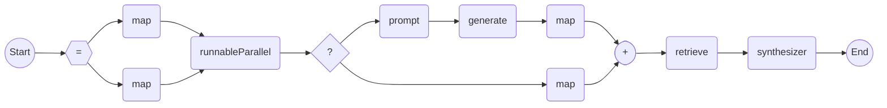

## 简介

WaterFlow 利用了一种“基于节点的响应式流”的模式，流的定义与数据源解耦，允许先行定义一个通用的数据处理流程，然后根据需要将不同的数据源灌入其中。

AI 流程在 WaterFlow 的基础上，定义了AI 流程的结构信息，具有数据处理能力，增加流程间的数据流转能力，并对外提供对话语义。

## 示例

- 在 AI 流程中，**RAG（检索增强生成）**是一个常用技术，帮助模型解决知识密集型任务下的幻觉问题，并且解决了模型知识库的时效性问题，帮助模型有效更新语料。
- 以下代码定义了一个**知识检索流程**，该流程接收一个 `Tip` 对象，首先根据问题和历史记录，对原问题进行重写，提供一些上下文或背景信息，再从向量数据库中检索出相关知识并返回。

``` java
AiProcessFlow<Tip, Content> retrieveFlow = AiFlows.<Tip>create()
    .runnableParallel(history(), passThrough())
    .conditions()
    .match(tip -> !tip.freeze().get(DEFAULT_HISTORY_KEY).text().isEmpty(),
            node -> node.prompt(Prompts.human(REWRITE_PROMPT))
                    .generate(chatFlowModel)
                    .map(ChatMessage::text))
    .others(node -> node.map(tip -> tip.freeze().get("query").text()))
    .retrieve(new DefaultVectorRetriever(vectorStore, SearchOption.custom().topK(1).build()))
    .synthesize(docs -> Content.from(docs.stream().map(Document::text).collect(Collectors.joining("\n\n"))))
    .close();
```



1. 上述代码首先创建一个AI 流程，调用 `runnableParallel` 生成并行分支节点，其中一个节点是**历史记录**键值对分支，另一个是透传参数分支。
2. 随后利用 `conditions` 开启条件分支，如果在满足该分支条件时执行`match`中的逻辑，否则执行 `others` 中的默认逻辑。
3. 之后使用 `retrieve` 从向量数据库中检索相关知识。
4. 最后生成检索合成节点，并在流程最后添加终止节点。
5. 就此创建一个 AI 流程，调用 offer 向流程中注入数据数组，驱动流程流转。

## 会话

- AI 流程的**会话对象**是启动流程的入口，流程开始流转后异步执行，并生成一个流程调用的同步器，可阻塞当前线程，直到流程正常或异常结束时停止阻塞，结束流程。
- 通过在流程启动之前设置**回调函数**，可以根据一个会话结束返回的状态调用对应的回调函数。

### 回调函数

- `doOnConsume`：设置数据消费回调，流程成功结束后调用此函数消费流程产生的结果，可被多次调用。
- `doOnError`：设置异常回调，流程异常结束会触发该回调。
- `doOnCompleted`：设置成功结束回调，流程成功结束时会触发该回调。
- `doOnFinally`：设置结束回调，流程成功结束或异常时都会触发该回调。

### 示例

``` java
String errorMsg = "test exception.";
AiProcessFlow<String, String> exceptionFlow = AiFlows.<String>create()
    .map(input -> input)
    .just(input -> { throw new IllegalStateException(errorMsg); })
    .close();

StringBuilder answer = new StringBuilder();
ConverseLatch<String> latch = exceptionFlow.converse()
    .doOnError(throwable -> answer.append(throwable.getMessage()))
    .doOnFinally(() -> answer.append(" finally"))
    .offer("test data");
```

1. 上述代码首先定义一个 AI 流程，该流程在结束部分抛出异常。
2. 随后通过调用 `exceptionFlow.converse()` 生成生成一个会话，开始注册回调函数。
3. `doOnError` 设置流程异常结束回调，`doOnFinally` 设置默认结束回调，并将信息记录在变量`answer`中。设置完成后向流程中`offer`数据，驱动流程流转。
4. 流程执行完成后向外抛出异常，调用对应的回调函数，回调函数向变量`answer`中写入信息。
