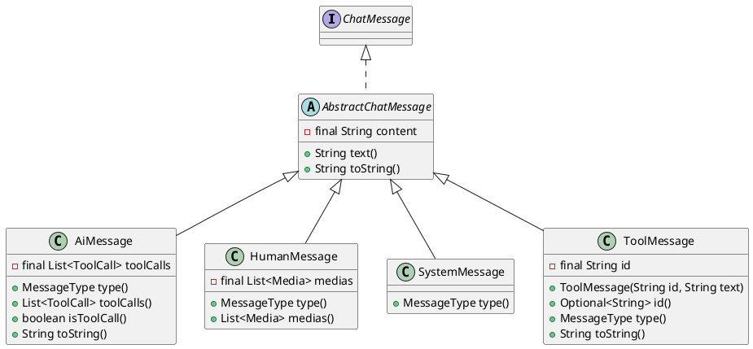

提示词（Prompt）在大语言模型应用中至关重要，它是提供给大模型的一段文字、指令或者图片和文件，通常由指令、上下文、输入数据、输出指示组成，如下图所示，指令为想要模型执行的特定任务的信息；上下文包含背景信息，可为外部信息；输入数据为用户输入的内容或问题；输出指示可指定输出的类型或格式。使用提示词可引导模型生成更加明确的内容，也可限制和减少模型生成无用内容的次数，提高对话的效率。

如下代码展示了 FEL 中的提示词接口及其实现类。

```java
public interface Prompt {
    /**
     * 获取输入的聊天消息列表。
     *
     * @return 表示聊天消息列表的 {@link List}{@code <}{@link ChatMessage}{@code >}。
     */
    List<? extends ChatMessage> messages();

    /**
     * 获取文本内容。
     *
     * @return 返回表示文本内容的 {@link String}。
     */
    default String text() {...}
}

public class ChatMessages implements Prompt {
    private final List<ChatMessage> messages = new ArrayList<>();
    // 省略构造器和方法。
}
```

- `ChatMessage`：表示聊天消息的接口

# 聊天消息

聊天消息用于表示聊天中的每一条消息，包含角色和消息内容。下图展示了消息框架下的接口和实现：



`AbstractChatMessage` 和它的实现包括了 4 种消息类型，主要用于定义发出消息一方的身份：

- `system`：表示系统消息，用于指导大模型的行为和输出规范，可以定义表达风格或者制定规则来影响模型的回应方式和输出。
- `human`：表示人类消息，用于给大模型提问题，发指令或是陈述需求，人类消息通常占据对话的一方。
- `ai`：表示 AI 消息，用于返回大模型的输出，构成了对话的另一方。
- `tool`：表示工具消息，用于返回大模型调用工具后的结果输出。一些大模型支持工具的调用，工具消息可以满足大模型与工具之间的交互。

```java
public enum MessageType {
    SYSTEM("system"),

    HUMAN("human"),

    AI("ai"),

    TOOL("tool");

    private final String role;

    private static final Map<String, MessageType> RELATIONSHIP =
        Arrays.stream(MessageType.values()).collect(
            Collectors.toMap(MessageType::getRole, Function.identity()));

    MessageType(String role) {
        this.role = role;
    }

    public static MessageType parse(String role) {
        return RELATIONSHIP.getOrDefault(role, MessageType.HUMAN);
    }
}
```

# 提示技巧

## 示例

示例是具体的任务案例，用于帮助模型理解任务的格式、期望的输入和输出类型。在提示词中，示例通过实际的输入输出对提供具体的例子，使得模型不再依赖抽象的语言任务描述，而是根据实际的示例理解任务的输入输出关系，这样可以显著提高提示词的效果，帮助模型更好地执行任务。

```java
public class DefaultExample implements Example {
    /**
     * 表示示例的问题。
     */
    private final String question;

   /**
    * 表示示例的回答。
    */
    private final String answer;
    
    // 省略构造器。

    @Override
    public String question() {
        return this.question;
    }

    @Override
    public String answer() {
        return this.answer;
    }
}
```

根据提示词中包含的示例数量，可以将其划分为无样本提示（Zero-shot Prompting）、单样本提示（One-shot Prompting）、少样本提示（Few-shot Prompting）：

- 无样本提示即大模型在没有任何提示样例的情况下，直接去解决问题或者完成一个任务，这意味着模型完全依赖已有的知识库生成结果，适用于简化任务或无数据场景；
- 单样本提示如字面意思，给大模型提供单个样本示例，向其说明任务的格式和期望的输出。往往有参考示例的时候大模型的输出会更容易符合预期，适用于简单任务的增强输出；
- 少样本提示即提供少量多个示例来帮助大模型生成回复，多个示例可以更充分地展示任务的模式，更好地获取一个规范的返回输出，也能够强化模型的输出逻辑，适用于复杂任务或需要高质量输出的场景

<br>

随着示例数量的增加，模型的理解和推断能力通常会有所提升，但同时复杂性和对提示词设计的要求也会增加。FEL 中支持少样本提示。

## 示例选择器

示例选择器用于从大量的示例中筛选出符合要求的示例。

```java
public class DefaultExampleSelector implements ExampleSelector {
    /**
     * 表示批量字符串模板进行渲染输出的字符串示例，详见批量字符串模板。
     */
    private final BulkStringTemplate bulkTemplate;

    /**
     * 表示包含了所有示例的数组。
     */
    private final List<Example> examples;

    /**
     * 表示用于过滤出符合条件的示例的过滤器。
     */
    private final BiFunction<List<Example>, String, List<Example>> filter;

   /**
    * 表示用于将单独的示例包装进映射的处理器。
    */
    private final Function<Example, Map<String, String>> processor;
```

示例：

```java
Example[] examples = {new DefaultExample("2+2", "4"), new DefaultExample("2+3", "5")};
ExampleSelector exampleSelector = ExampleSelector.builder()
                .template("人类: {{q}}\nAI: {{a}}", "q", "a")
                .example(EXAMPLES)
                .delimiter("\n")
                .filter((es, q) -> es.stream().filter(e -> e.question().equals(q)).collect(Collectors.toList()))
                .build();
System.out.print(exampleSelector.select("2+2"))
```

打印台输出：

```markdown
人类: 2+2
AI: 4
```

少样本提示在 AiFlow 中的应用示例：

```java
StringBuilder answer = new StringBuilder();
Example[] examples = {new DefaultExample("2+2", "4"), new DefaultExample("2+3", "5")};
Conversation<String, Prompt> converse = AiFlows.<String>create()
        .runnableParallel(question(), 
            fewShot(ExampleSelector.builder()
            .template("{{q}}={{a}}", "q", "a")
            .delimiter("\n")
            .example(examples)
            .build()))
        .prompt(Prompts.human("{{examples}}\n{{question}}="))
        .close()
        .converse();
converse.doOnSuccess(r -> answer.append(r.text())).offer("1+2").await();
System.out.println(answer.toString())
```

打印台输出：

```markdown
2+2=4
2+3=5
1+2=
```
