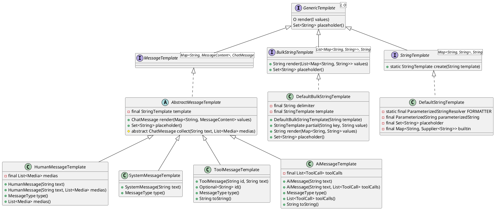

# 模板

模板的核心作用是提供一个预定义的格式或者结构，用来快速生成具有一致性的内容。下图展示了模板框架下的接口和实现。



通用泛型提示模板接口定义如下：

``` java
public interface GenericTemplate<I, O> {
    /**
     * 根据输入参数渲染模板，生成结果。
     *
     * @param values 表示输入参数的 {@link Object}。
     * @return 返回表示渲染结果的 {@link Object}。
     */
    O render(I values);

    /**
     * 获取模板占位符集合。
     *
     * @return 返回表示模板占位符集合的 {@link Set}{@code <}{@link String}{@code >}。
     */
    Set<String> placeholder()
}
```

## 字符串模板

字符串模板基于 [mustache](https://mustache.github.io/) 语法的文本模板引擎，输入从字符串到字符串的映射用于填充模板占位符，输出为字符串。字符串模板支持完全填充和部分填充。

``` java
public interface StringTemplate extends GenericTemplate<Map<String, String>, String> {}
```

### 完全填充

完全填充 `render()` 需要一次性填充全部的占位符，示例：

``` java
String template = "给我讲个关于{{内容}}的{{载体}}。";
Map<String, String> values = 
        MapBuilder.<String, String>get().put("内容", "兔子").put("载体", "故事").build();
String output = new DefaultStringTemplate(template).render(values);
System.out.println(output);
```

打印台输出：

```markdown
给我讲个关于兔子的故事。
```

### 部分填充

部分填充可以先用 `partial()` 填充部分占位符，然后再用 `render()` 填充剩余的占位符，示例：

``` java
String template = "给我讲个关于{{内容}}的{{载体}}。";
StringTemplate partial = new DefaultStringTemplate(template).partial("内容", "兔子");
System.out.println(partial.render(MapBuilder.<String, String>get().put("载体", "故事").build()));
System.out.println(partial.render(MapBuilder.<String, String>get().put("载体", "笑话").build()));
```

打印台输出：

```markdown
给我讲个关于兔子的故事。
给我讲个关于兔子的笑话。
```

## 批量字符串模板

批量生成字符串模板 `BulkStringTemplate` 使用同一个字符串模板连续生成相近的字符串并用分隔符进行连接，输入为一个字符串到字符串的映射数组，输出为字符串，如下为批量生成字符串模板接口及其实现：

``` java
public interface BulkStringTemplate extends GenericTemplate<List<Map<String, String>>, String> {}

public class DefaultBulkStringTemplate implements BulkStringTemplate {
    private final String delimiter;
    private final StringTemplate template;
    // 省略构造器及方法。
```

示例：

``` java
String template = "{{0}}是{{1}}，但不是所有的{{1}}都是{{0}}。";
List<Map<String, String>> values = new ArrayList<>();
values.add(MapBuilder.<String, String>get().put("0", "狗").put("1", "动物").build());
values.add(MapBuilder.<String, String>get().put("0", "猫").put("1", "动物").build());
String output = new DefaultBulkStringTemplate(template, "\n").render(values);
System.out.println(output);
```

打印台输出：

```
狗是动物，但不是所有的动物都是狗。
猫是动物，但不是所有的动物都是猫。
```

## 消息模板

消息内容可以是简单的文本，也可以包含图片信息。根据模型可接收的消息类型不同可以使用不同的方法来包装内容，分成了 `HumanMessageTemplate`、`SystemMessageTemplte`、` ToolMessageTemplate`、`AiMessageTemplate` 四类模板，分别用于渲染人类消息、系统消息、工具消息、AI  消息。

``` java
public interface MessageTemplate extends GenericTemplate<Map<String, MessageContent>, ChatMessage> {}
```
``` java
public final class MessageContent {
    private final String text;
    private final List<Media> medias;

    public static MessageContent from(Media... medias) {...}
    public static MessageContent from(String text, Media... medias) {...}
    // 省略方法。
```

示例：

``` java
MessageTemplate template = new HumanMessageTemplate("我喜欢{{staff1}}, {{staff2}}还有{{staff3}}");
Tip tip = new Tip().add("staff1", MessageContent.from("唱歌", new Media("image/png", "singing.png")))
        .add("staff2", MessageContent.from("跳舞", new Media("image/png", "dance.png")))
        .add("staff3", MessageContent.from("打篮球", new Media("image/png", "basketball.png")));
ChatMessage message = template.render(tip.freeze());
System.out.println(message.text())
```

打印台输出：

```markdown
我喜欢唱歌，跳舞还有打篮球。
```

# 输出解析器

LLM 产生结构化输出的能力对于依赖可靠解析输出值的下游应用程序非常重要。开发人员希望将 AI 模型的结果快速转换为数据类型，例如 Java 类，这些数据类型可以传递给其他应用程序的函数和方法。FEL 输出解释器可以将 LLM 输出转换为结构化格式。接口如下：

``` java
public interface OutputParser<O> extends FormatProvider, Parser<String, O> {}
```

解析器调用的接口帮助实现了引导模型输出和将输出转换成对象的流程。
`FormatProvider`：格式化器用于提供语言模型的输出应该如何格式化的提示词。
`Parser`：解析器提供把输入解析成指定对象的方法。

实现接口如下：

``` java
public interface FormatProvider {
    String instruction();
}
```

``` java
public interface Parser<I, R> {
    R parse(I input);
}
```

## 解析成 JavaBean

通过在目标 Java 类的注释 `@Property` 中添加 `description`、`defaultValue`、`required` 参数来扩充指引。

示例：

``` java
static class Joke{
    @Property(description = "question to set up a joke", required = True, defaultValue: "等病好了我就去看医生。")
    private String setup;

    @Property(description = "answer to resolve the joke")
    private String punchline;

    // 省略获取和设置值的方法。
}
```

### 完整解析

``` java
ObjectSerializer serializer = new JacksonObjectSerializer(null, null, null);
OutputParser<Test> outputParser = JsonOutputParser.create(serializer, Test.class);
String json = "{\"setup\": \"有一只鲨鱼吃下了一颗绿豆，结果它变成了什么？\",\"punchline\": \"绿豆沙\"}";
Joke joke = outputParser.parse(json);
System.out.println(outputParser.instruction())
System.out.println(joke.getSetup())
System.out.println(joke.getPunchline())
```

打印台输出：

````markdown
The output should be formatted as a JSON instance that conforms to the JSON schema below.
Here is the output schema:
```
{"type":"object","required":["setup"],"properties":{"punchline":{"type":"string","description":"answer to resolve the joke"},"setup":{"type":"string","description":"question to set up a joke","default":"等病好了我就去看医生。"}}}
```
有一只鲨鱼吃下了一颗绿豆，结果它变成了什么？
绿豆沙
````

### 片段解析

当被解析的对象不能保证覆盖 JavaBean 的全部 `Field` 字段，可以使用 `createParial` 来解析出部分输出对象：

``` java
OutputParser<Test> outputParser = JsonOutputParser.createPartial(serializer, Test.class);
String json = "{\"setup\": \"有一只鲨鱼吃下了一颗绿豆，结果它变成了什么？\", \"punchline\":}";
Joke joke = outputParser.parse(json);
System.out.println(joke.getSetup())
System.out.println(joke.getPunchline())
```

打印台输出：

```markdown
有一只鲨鱼吃下了一颗绿豆，结果它变成了什么？
null
```

## 解析 Markdown 代码块

FEL 中提供了 `MarkdownCompatibleParser`这个类来实现对 Markdown 代码块的解析。

``` java
public class MarkdownCompatibleParser<O> implements OutputParser<O> {
    private final OutputParser<O> outputParser;

    /**
     * 表示 json 格式字符串匹配模式。
     */
    private final Pattern pattern;

    /**
     * 使用输出解析器创建 {@link MarkdownCompatibleParser} 的实例。
     *
     * @param outputParser 表示对象解析器的 {@link OutputParser}。
     * @param prefix 表示代码类型的 {@link String}。
     * @throws IllegalArgumentException <ul>
     * <li>当 {@code outputParser} 为 {@code null} 时；</li>
     * <li>当 {@code prefix} 为空字符串时。</li>
     * </ul>
     */
    public MarkdownCompatibleParser(OutputParser<O> outputParser, String prefix) {...}

    /**
     * 获取规范模型输出的提示词。
     *
     * @return 表示提示词的 {@link String}。
     */
    @Override
    public String instruction() {...}

    /**
     * 将输入转换为对象。
     *
     * @param input 表示输入的 {@link I}。
     * @return 表示输出对象的 {@link O}。
     */
    @Override
    public O parse(String input) {...}
}
```

解析 Markdown 的 json 代码块示例：

``` java
Parser<String, Joke> outputParser =
        new MarkdownCompatibleParser<>(JsonOutputParser
            .create(TEST_SERIALIZER, Joke.class), "json");
Joke joke = outputParser.parse("```json\n{\"setup\" : \"foo\", \"punchline\": \"bar\"}\n```");
System.out.println(joke.getSetup());
System.out.println(joke.getPunchline());
```

打印台输出：

``` java
foo
bar
```
