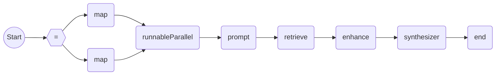

检索增强生成 （RAG） 的核心思想是通过从外部数据源中检索相关信息，结合生成模型的生成能力，输出更加准确和上下文相关的回答。RAG 能够弥补生成模型在处理知识密集型任务中的缺陷，因为生成模型只依赖于自身的训练数据，而不能访问实时更新的信息，通过结合检索机制，模型能够动态地引入外部信息并生成更为丰富的输出。

在检索前，系统会根据用户的查询生成一个查询向量。然后，它会在一个预先构建的知识库或文档库中检索与该查询最相关的内容。检索的过程通常通过向量相似性计算来完成，向量可以表示文档的语义信息，利用向量数据库（VectorStore）来存储和管理这些向量。下面介绍检索中的各模块。

# 数据源

数据源主要进行文档的加载。文档是检索内容的实体，具有唯一编号以及元数据两个属性。

``` java
public interface Document extends Content {
    /**
     * 获取文档的唯一编号。
     *
     * @return 表示文档唯一编号的 {@link String}。
     */
    String id();

    /**
     * 获取文档的元数据。
     *
     * @return 表示文档元数据的 {@link Map}{@code <}{@link String}{@code , }{@link Object}{@code >}。
     */
    @Nonnull
    Map<String, Object> metadata();

    // 省略构建器。
}
```

`MeasurableDocument` 为文档接口的一种实现，它具有文档评分的属性，便于后续的检索与排序。

``` java
public class MeasurableDocument implements Document, Measurable {
    /**
     * 表示原始文档。
     */
    private final Document document;

    /**
     * 表示文档评分。
     */
    private final double score;

    // 省略构造器和方法。
}
```

``` java
@FunctionalInterface
public interface Source<I> extends Pattern<I, List<Document>> {
    /**
     * 根据输入参数加载文档。
     *
     * @param input 表示输入参数的 {@link I}。
     * @return 表示加载文档列表的 {@link List}{@code <}{@link Document}{@code >}。
     */
    List<Document> load(I input);

    @Override
    default List<Document> invoke(I input) {
        return this.load(input);
    }
}
```

## Json 文件源

json 文件加载示例：

``` java
ObjectSerializer serializer = new JacksonObjectSerializer(null, null, null);
Source<File> fileSource = new JsonFileSource(serializer, StringTemplate.create("{{instruction}}\n{{output}}"));
URL url = this.getClass().getClassLoader().getResource("demo.json");
File file = FileUtils.file(url);
List<Document> documents = fileSource.load(file);
System.out.println(documents.get(0).text());
System.out.println(documents.get(1).text());
```

“demo.json” 文件如下所示：

```json
[
  {
    "instruction": "instruction1",
    "input": "input1",
    "output": "output1"
  },
  {
    "instruction": "instruction2",
    "input": "input2",
    "output": "output2"
  }
]
```

打印台输出：

```plaintext
instruction1
output1
instruction2
output2
```

## 文本文件源

文本文件加载示例：

``` java
Source<File> fileSource = new TextFileSource();
URL url = this.getClass().getClassLoader().getResource("demo.txt");
File file = FileUtils.file(url);
List<Document> documents = fileSource.load(file);
System.out.println(documents.get(0).text());
```

“demo.txt” 文件如下所示：

```plaintext
文本文件加载成功！
```

打印台输出：

```plaintext
文本文件加载成功！
```

# 文本分割器

文本分割器是一种用于将长文本文档分割成更小、更易于管理的单元的处理工具。其主要作用如下：

- **优化资源利用**：通过将长文档切割成较小的部分，减少对计算资源的需求，使模型能够更高效地处理大规模文本数据；
- **提高检索效率**：较小的文本块可以加快搜索和匹配过程，因为每个块包含的信息更集中，减少了无关信息的干扰；
- **提升生成质量**：通过专注于每个小块的内容，模型能够生成更准确和相关的响应，有助于提升生成内容的质量。

文本分割器通常可以根据不同的需求和应用场景，采用多种分割方法，如固定大小的字符分割、基于语义的分割等。在 RAG 中，合理的文本分割策略对于优化资源利用、提高检索效率和提升生成质量至关重要。

``` java
public abstract class AbstractTextSplitter implements Splitter<Document> {
    @Override
    public List<Document> split(Document document) {
        return this.splitText(document.text())
                .stream()
                .map(chunk -> Document.custom().text(chunk).metadata(document.metadata()).build())
                .collect(Collectors.toList());
    }

    /**
     * 分割给定的文本。
     *
     * @param text 表示需要被分割文本的 {@link String}。
     * @return 表示分割后文本列表的 {@link String}{@code <}{@link String}{@code >}。
     */
    protected abstract List<String> splitText(String text);
}
```

FEL 中实现了根据分词数进行切割的文本分割器 `TokenTextSplitter`，示例如下：

``` java
// 创建一个分词器对象。该分词器仅为简单实现，按单个字符进行分词。
Tokenizer tokenizer = new SimpleTokenizer();
// 参数列表中依次为分词器，分块大小，分块重叠大小。
Splitter<Document> splitter = new TokenTextSplitter(tokenizer, 2, 1);
Document document = Document.custom().text("This is demo.").metadata(new HashMap<>()).build();
splitter.split(document).stream().map(doc -> doc.text()).forEach(System.out::println);
```

打印台输出：

```plaintext
Th
hi
is
s 
 i
is
s 
 d
de
em
mo
o.
```

# 向量数据库

向量数据库（VectorStore）是一个用于存储和管理向量的数据库。在 RAG 中，向量数据库起到了关键作用，它帮助我们通过存储和检索高维向量来找到与查询最相关的内容，具体提供三大功能：

- ​**向量生成**​：将文本、图像等数据通过嵌入模型生成特征向量。
- ​**向量存储**​：生成的向量会被存储在向量数据库中，便于后续检索。
- ​**向量检索**​：当有查询时，向量数据库会计算查询向量与存储向量的相似度，并返回最相关的向量。

``` java
public interface VectorStore extends DocumentStore {
    /**
     * 执行向量检索。
     *
     * @param query 表示用户询问的 {@link String}。
     * @param option 表示搜索参数的 {@link SearchOption}.
     * @return 表示搜索结果列表的 {@link List}{@code <}{@link MeasurableDocument}{@code >}。
     */
    List<MeasurableDocument> search(String query, SearchOption option);

    /**
     * 删除指定唯一标识的文档。
     *
     * @param ids 表示需要删除的文档标志的 {@link List}{@code <}{@link String}{@code >}。
     */
    void delete(List<String> ids);
}

public interface DocumentStore extends Store<List<Document>> {}

@FunctionalInterface
public interface Store<D> extends Pattern<D, Void> {
     /**
      * 添加数据到存储中。
      *
      * @param data 表示待添加数据的 {@link D>}。
      */
     void persistent(D data);

     @Override
     default Void invoke(D data) {
         this.persistent(data);
         return null;
     }
}
```

如下所示为向量数据库的一个简易实现：

``` java
public class MemoryVectorStore implements VectorStore {
    private final DocumentEmbedModel embedModel;
    private final Map<String, DocumentWithEmbedding> cache = new ConcurrentHashMap<>();

    /**
     * 创建 {@link MemoryVectorStore} 的实例。
     *
     * @param embedModel 表示嵌入文档模型的 {@link DocumentEmbedModel}。
     */
    public MemoryVectorStore(DocumentEmbedModel embedModel) {
        this.embedModel = embedModel;
    }

    @Override
    public void persistent(List<Document> documents) {
        List<Embedding> embeddings = this.embedModel.embed(documents);
        for (int i = 0; i < documents.size(); ++i) {
            DocumentWithEmbedding document =
                    DocumentWithEmbedding.from(documents.get(i), embeddings.get(i).embedding());
            this.cache.put(document.id(), document);
        }
    }

    @Override
    public List<MeasurableDocument> search(String query, SearchOption option) {
        List<Float> queryEmbedding = this.embedModel.embed(query).embedding();
        return this.cache.values()
                .stream()
                .map(d -> new MeasurableDocument(d, MathUtils.cosineSimilarity(queryEmbedding, d.getEmbedding())))
                .sorted(Comparator.comparingDouble(MeasurableDocument::score).reversed())
                .limit(option.topK())
                .collect(Collectors.toList());
    }

    @Override
    public void delete(List<String> ids) {
        Validation.notNull(ids, "The id list cannot be null.");
        ids.forEach(this.cache::remove);
    }

    /**
     * 从输入流中加载数据到内存中。
     *
     * @param in 表示输入流的 {@link InputStream}。
     * @param objectSerializer 表示对象序列化器的 {@link ObjectSerializer}。
     */
    public void load(InputStream in, ObjectSerializer objectSerializer) {
        Map<String, DocumentWithEmbedding> documents = objectSerializer.deserialize(in,
                TypeUtils.parameterized(Map.class, new Type[] {String.class, DocumentWithEmbedding.class}));
        this.cache.putAll(documents);
    }

    /**
     * 将数据从内存中保存到输出流中。
     *
     * @param out 表示输出流的 {@link OutputStream}。
     * @param objectSerializer 表示对象序列化器的 {@link ObjectSerializer}。
     */
    public void persist(OutputStream out, ObjectSerializer objectSerializer) {
        objectSerializer.serialize(this.cache, out);
    }

    /**
     * 表示携带嵌入向量的 {@link Document}。
     */
    private static class DocumentWithEmbedding implements Document {
        private String id;
        private String text;
        private Map<String, Object> metadata;
        private List<Float> embedding;

        // 省略构造器与方法
    }
}
```

向量数据库示例：

``` java
VectorStore vectorStore = new MemoryVectorStore(new DefaultDocumentEmbedModel(new EmbedModelStub(), 
        EmbedOption.custom().build()));
vectorStore.persistent(EmbedModelStub.generateDemoDocuments());
vectorStore.search("demo", SearchOption.custom().topK(3).build()).stream()
       .forEach(document -> System.out.println("text: " + document.text() + ", score: " + document.score()));
```

其中，`EmbedModelStub` 为嵌入模型服务的打桩实现，调用 `generateDemoDocuments()` 生成的文档如下：

```plaintext
Document{metadata={}, id=null, text=demo0}
Document{metadata={}, id=null, text=demo1}
Document{metadata={}, id=null, text=demo2}
```

打印台输出：

```plaintext
text: demo0, score: 1.0
text: demo2, score: 0.3311495156931359
text: demo1, score: 0.2706103425216371
```

# 检索算子

检索算子（Retriever）是检索过程的核心之一，其目标是找到与用户输入最匹配的内容，并通过高效的检索算法从海量数据中筛选出有限数量的有用信息，大致分为三种方式：

- ​**关键词匹配（Term-based Retrieval）**​：这是传统的信息检索方法，通过将用户查询与文档中的关键词进行匹配。匹配度越高的文档，被认为越相关。
- ​**向量检索（Vector-based Retrieval）**​：在现代系统中，通常通过向量表示来进行检索。查询和文档被转换为向量表示，通过计算查询向量和文档向量之间的相似度（通常使用余弦相似度）来判断相关性。
- ​**混合检索**​：有时，会结合关键词匹配和向量检索两种方式，以提高检索的精度。

``` java
@FunctionalInterface
public interface Retriever<I, O extends Measurable> extends Pattern<I, List<O>> {
    /**
     * 根据用户输入进行检索。
     *
     * @param query 表示用户输入的 {@link I}。
     * @return 返回可量化数据的 {@link List}{@code <}{@link O}{@code >}。
     */
    List<O> retrieve(I query);

    @Override
    default List<O> invoke(I query) {
        return this.retrieve(query);
    }
}
```

如下是检索器的一个简单实现：

``` java
public class DefaultVectorRetriever implements Retriever<String, MeasurableDocument> {
    private final VectorStore vectorStore;
    private final SearchOption searchOption;
    
    // 省略构造方法

    @Override
    public List<MeasurableDocument> retrieve(String query) {
        return this.vectorStore.search(query, searchOption);
    }
}
```

该检索器采用了向量检索的工作方式，并使用余弦相似度来判断文档之间的相关性。示例如下：

``` java
List<Document> documents = EmbedModelStub.generateDemoDocuments();
VectorStore vectorStore = new MemoryVectorStore(new DefaultDocumentEmbedModel(new EmbedModelStub(),
        EmbedOption.custom().build()));
vectorStore.persistent(documents);
Retriever<String, MeasurableDocument> retriever =
        new DefaultVectorRetriever(vectorStore, SearchOption.custom().topK(1).build());
retriever.retrieve("demo0").stream().forEach(document
        -> System.out.println("text: " + document.text() + ", score: " + document.score()));
```

打印台输出：

```plaintext
text: demo0, score: 1.0
```

# 后置处理器

后置处理器（Postprocessor）是用于处理检索结果的一类工具。这些处理可以包括格式化文本、纠正错误、过滤不相关信息、优化可读性，甚至根据上下文或业务需求重新组织输出。

``` java
@FunctionalInterface
public interface PostProcessor<D> extends Pattern<D, D> {
    /**
     * 对检索结果进行后处理。
     *
     * @param data 表示输入数据的 {@link D}。
     * @return 表示处理后数据的 {@link D>}。
     */
    D process(D data);

    @Override
    default D invoke(D data) {
        return this.process(data);
    }
}
```

# 检索结果合成器

检索结果合成器是检索中的一个重要组件，负责将从知识库中获取的多个相关文档进行汇总、整合，并作为输入供生成模型生成最终答案。简单来说，它的作用是对检索到的信息进行“智能整合”，帮助生成模型生成更具连贯性、准确性和信息丰富的回答。

``` java
@FunctionalInterface
public interface Synthesizer<I> extends Pattern<I, Content> {
    /**
     * 将检索的数据进行合成。
     *
     * @param input 表示检索数据的 {@link I}。
     * @return 表示合成结果的 {@link Content}。
     */
    Content synthesize(I input);

    @Override
    default Content invoke(I input) {
        return this.synthesize(input);
    }
}
```

<br>

可对上述各模块进行设计编排，即可快速搭建属于自己业务的 RAG 服务。示例：

1. 前置准备：自定义 `Memory`、`Retriever` 等。

``` java
final StringBuilder answer = new StringBuilder();
ChatMessages messages = new ChatMessages();
Memory memory = new CacheMemory() {
    @Override
    public String text() {
        return "my history";
    }
};
Retriever<Prompt, MeasurableDocument> retriever =
        input -> Collections.singletonList(new MeasurableDocument(Document.custom()
                .text("[context: " + input.text() + "]")
                .medias(Collections.singletonList(new Media("image/png", "url")))
                .metadata(Collections.emptyMap())
                .build(), 0.6f));
```

2. 定义 RAG 流程。该流程接收一个 `Tip` 对象，首先将历史记录整合到提示词中，再根据提示词从向量数据库中检索出相关知识，经过后置处理器的处理后，最后由检索结果合成器进行合成，添加到回答中。

``` java
AiProcessFlow<Tip, Content> ragFlow = AiFlows.<Tip>create()
        .runnableParallel(history(), passThrough())
        .prompt(Prompts.human("enhance {{q1}} with {{history}}")) // 生成提示词。
        .retrieve(retriever) // 执行检索。
        .enhance(d -> d) // 调用后置处理器。
        .synthesize(d -> d.get(0)) // 合成检索结果。
        .close(r -> answer.append(r.text()));
```



3. 定义完整流程，并开启一个会话，最终输出结果。

``` java
AiFlows.<Tip>create()
       .runnableParallel(value("context", ragFlow), history("history"), passThrough())
       .prompt(Prompts.human("answer {{q1}} and {{q2}} from {{context}} with {{history}}"))
       .close(r -> messages.addAll(r.messages()))
       .converse()
       .bind(memory)
       .offer(Tip.from("q1", "my question1").add("q2", "my question2"))
       .await();
System.out.println(answer);
System.out.println(messages.text());
```

打印台输出：

```plaintext
[context: enhance my question1 with my history]
answer my question1 and my question2 from [context: enhance my question1 with my history] with my history
```
