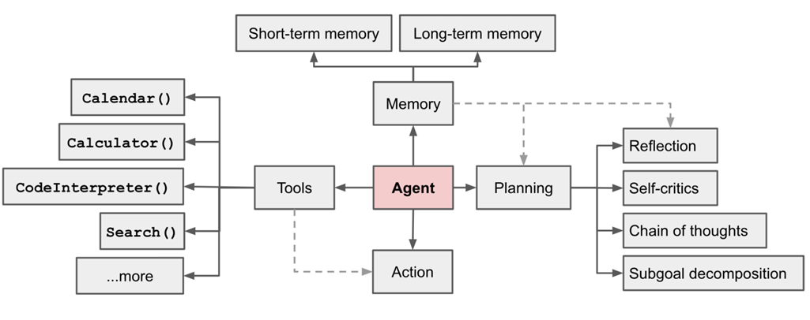

## 简介

**Agent**（智能体）是一种通过结合大模型与外部工具或系统来执行复杂任务的机制。Agent 可以视为一种智能代理，它根据用户的指令动态选择、调用适当的工具或执行特定操作，最终完成用户的需求。

目前，有 4 种主要的 Agent 设计模式，分别是：
1）Reflection：让 Agent 审视和修正自己生成的输出；
2）Tool Use：LLM 生成代码、调用 API 等进行实际操作；
3）Planning：让 Agent 分解复杂任务并按计划执行；
4）Multiagent Collaboration：多个 Agent 扮演不同角色合作完成任务。

目前应用比较多的是 2) 和 4)，FEL 针对工具调用和多智能体提出了针对性的解决方案，可以轻松实现工具调用的多智能体互通。



## 工作流程

1. **接收用户输入**：用户向 Agent 提出一个问题或任务，Agent 首先分析该输入。
2. **任务解析**：Agent 判断任务的需求，是否需要调用外部工具、执行计算或进行多步操作。
3. **工具调用或推理**：Agent 在必要时调用工具，执行相关任务。例如，用户询问天气，Agent 会调用天气 API；如果用户要求某些计算，Agent 会执行相应的代码或调用计算引擎。
4. **结果生成与反馈**：Agent 整合工具的输出，生成最终的结果，并将其返回给用户。

## 示例

1. 创建一个天气助手，并定义两个 FIT 函数 `get_current_temperature` 和 `get_rain_probability` 作为可以调用的工具。

``` java
@Fitable("default")
@ToolMethod(namespace = "example", name = "get_current_temperature", description = "获取指定城市的当前温度",
        extensions = {@Attribute(key = "tags", value = "FIT"), @Attribute(key = "tags", value = "TEST"),
                @Attribute(key = "attribute", value = "nothing"), @Attribute(key = "attribute", value = "nothing two")})
public String getCurrentTemperature(@Property(description = "城市名称", required = true) String location,
        @Property(description = "使用的温度单位，可选：Celsius，Fahrenheit", defaultValue = "Celsius") String unit) {
    return "26";
}

@Fitable("default")
@ToolMethod(name = "get_rain_probability", description = "获取指定城市下雨的概率")
public String getRainProbability(@Property(description = "城市名称", required = true) String location) {
    return "0.06";
}
```

2. 声明 `ToolRepository` 存放可用的工具，并定义一个流程，将用户问题委托给`agent`处理。

``` java
private final AiProcessFlow<String, ChatMessage> agentFlow;
private final ChatOption chatOption;
private final ToolRepository toolRepository;

public AgentExampleController(ChatModel chatModel, ToolExecuteService toolExecuteService,
        ToolRepository toolRepository, @Value("${example.model}") String modelName) {
    this.toolRepository = toolRepository;
    this.chatOption = ChatOption.custom().model(modelName).stream(false).build();
    DefaultAgent agent =
            new DefaultAgent(new ChatFlowModel(chatModel, this.chatOption), "example", toolExecuteService);
    this.agentFlow = AiFlows<String>create()
            .map(query -> Tip.fromArray(query))
            .prompt(Prompts.human("{{0}}"))
            .delegate(agent)
            .close();
}
```

3. 使用 `ToolRepository` 查找指定命名空间下的所有工具，并指定模型可以使用的工具列表为 `example` 空间下的工具

```
@GetMapping("/chat")
public ChatMessage chat(@RequestParam("query") String query) {
    List<ToolInfo> toolInfos = asParent(toolRepository.listTool("example"));
    return this.agentFlow.converse()
            .bind(ChatOption.custom(this.chatOption).tools(toolInfos).build())
            .offer(query)
            .await();
}
```

4. 用户调用接口后流程开始流转，如果用户问题是有关指定城市的天气或温度，`agent` 就会调用天气工具，否则此工具将不会被调用，实现了工具的动态选择。
