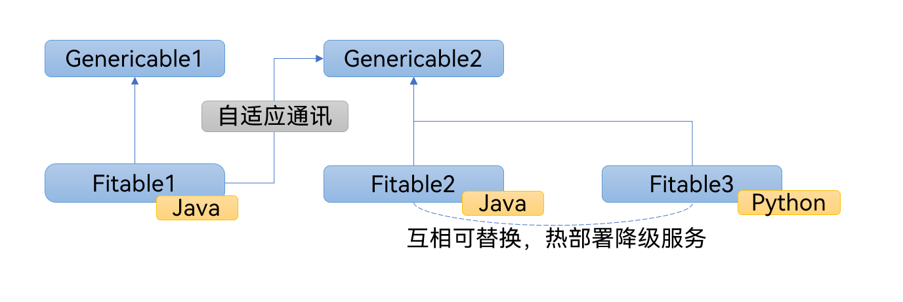
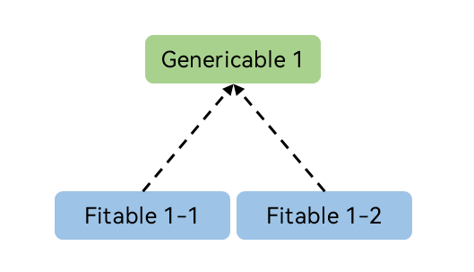
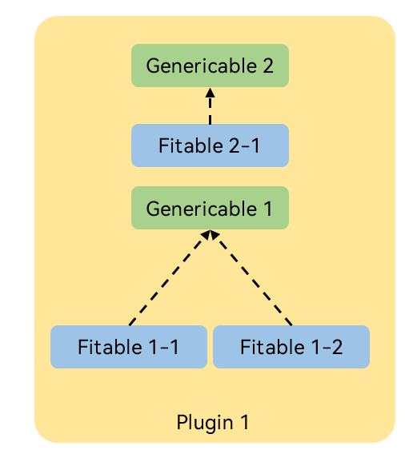
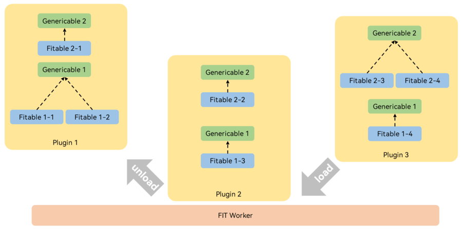
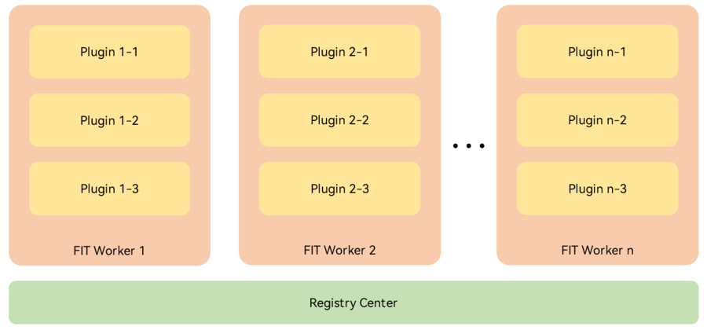

# FIT 函数平台简介

FIT 函数平台是一套支持多语言融合编程、插件化开发、聚散部署和共享内存的解决方案，旨在提供一种灵活的服务开发范式。

- 多语言融合编程：FIT 在多种编程语言中采用统一的接口描述标准，分别进行实现，并进行相互调用，以达到多语言互相融合协作的目的。
- 插件化开发：FIT 为多种编程语言分别提供了插件开发标准，允许插件在不依赖其他插件的前提下调用其他插件所提供的服务。
- 聚散部署：FIT 为多种编程语言分别提供了运行时环境，允许插件在其运行时环境中既可以单个插件独立进程运行，也可以多个插件共享进程运行。
- 共享内存：FIT 支持插件之间共享内存，即使多个插件分散为多个进程部署，也可以以内存访问的效率来访问共享数据。

# FIT 的设计理念

FIT 的核心设计理念是一切皆可替换，即在不影响功能正确性的前提下，任意服务、任意插件等都应该是可以替换的。在多语言融合编程中，相同的接口描述，在不同语言中存在不同的实现，那么这些实现就可以互相成为替换的备选；而选用了插件化进行开发，并灵活聚散部署，就可以在插件层面对一组功能服务接口进行完整的替换。这样做的好处就是，设计是非常灵活的，在不同的环境可以通过不同的替换组合来应对，而无需维护多个版本。

## 插件化开发理念

`Genericable`和`Fitable`是 FIT 编程框架中的核心概念，也是用户**可感知的最小单元**，其中，`Genericable`表示 FIT **泛服务定义**，可类比于 Java 编程语言中的接口，而`Fitable`表示 FIT ​**泛服务实现**​，可类比于 Java 编程语言中对于接口的实现。

首先，开发者在进行服务插件的开发时，需先定义一个`Genericable`，它定义了该服务的主要功能，再定义`Fitable`对该`Genericable`进行实现，一个`Genericable`可以对应多个`Fitable`，而一个`Fitable`只会归属于一个`Genericable`，这样的开发方式带来了几个 FIT 框架的关键特性：

1. 多态性：归属于同一个`Genericable`的不同`Fitable`之间是互相可替换的，它们实现同一个服务功能，而调用者无需关注`Fitable`的内部实现，同时也无需更改对`Genericable`的调用，从而实现插件的多态性。
2. 隔离开发：对`Fitable`进行开发时只需关注`Genericable`的定义，而无需关注外部调用方式等因素的影响，简化服务开发的同时提高了可维护性。
3. 泛服务性：FIT 框架中`Genericable`的理念使得一切服务皆可抽象，通过为调用方提供抽象的接口实现服务，简化了调用方的开发。
4. 聚散性：插件化开发极大提高了服务的部署灵活性，支持开发者自由选择定制化的部署方式。
5. 语言无关性：由于`Genericable`对服务进行了抽象定义，因此调用方无需关注`Fitable`内部实现使用的语言，可同时发挥不同语言的优势。

## 部署理念

FIT 框架中每一个插件都是独立的单元，同时它支持插件的动态加载和卸载，这为开发者提供了多种服务部署的特性：

1. 聚散性：开发者可自由选择聚合部署或分散部署，插件的部署方式可以互相灵活组合而不影响服务的实现。
2. 热部署：FIT 框架支持插件的热部署，这意味着插件之间可动态替换，即插即用，开发者可为服务设置降级部署的插件，这使得插件可以随时替换、更新与维护而不影响服务的运行。

## 插件生态

FIT 框架的插件化开发理念确保了插件的高度可重用性，这使得围绕 FIT 框架的多语言插件市场的实现成为可能，开发者无需对同一个功能进行重复的实现，而是可以利用插件市场现有的插件进行开发，综合利用多语言、多环境的优势。

# 基础概念

## Genericable 与 Fitable

`Genericable` 和 `Fitable` 是 FIT 编程框架中的核心概念，也是用户**可感知的最小单元**：

- `Genericable`：表示 FIT **泛服务定义**，可类比于 Java 编程语言中的接口方法。
- `Fitable`：表示 FIT **泛服务实现**，可类比于 Java 编程语言中对于接口方法的实现。

`Genericable` 只给出泛服务的定义而不给出具体的实现，其实现必须通过一个绑定到该 `Genericable` 的 `Fitable` 给出，两者之间的关系可类比为 Java 编程语言中接口及其实现类。因此一个 `Genericable` 可以对应多个 `Fitable`，而一个 `Fitable` 只会归属于一个 `Genericable`，对于每一个 `Genericable` 和 `Fitable` 都会有一个字符串格式的标识，即 `GenericableId` 和 `FitableId`。

## 插件

插件用于将 `Genericable` 和 `Fitable` 这些基础单元组织为**可供管理的最小单元**，一个插件中可以包含多个可供调用的泛服务实现，并且也可以在插件中调用其他泛服务实现。

插件需要运行于 FIT 运行时之上，FIT 运行时指一个独立运行的 FIT 服务进程，不同语言的插件需要运行于对应语言的 FIT 运行时之上，在 FIT 运行时在启动时或启动后可进行**插件加载**或**插件卸载**。

## 注册中心

运行于不同 FIT 运行时的 `Fitable` 之间能够互相进行调用，为了保证本运行时之上的服务能够被其他运行时找到并且能够找到其他运行时的服务，各个运行时之间**通过注册中心完成服务发现与注册**工作。
