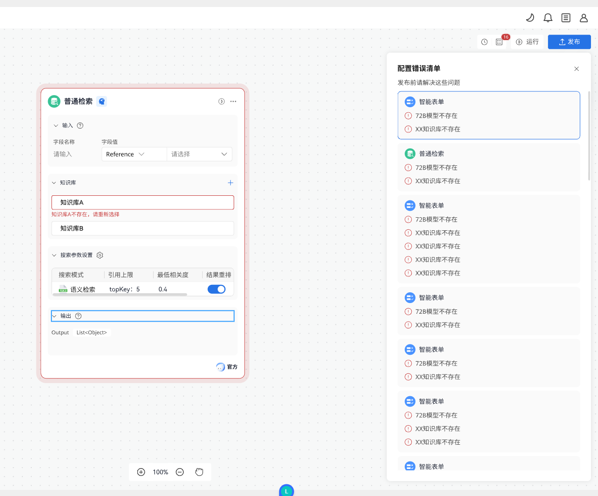

# <center>Elsa-React中节点表单的校验</center>

------

## 需求背景

应用需要支持导入导出，在导入应用以后需要对应用的数据进行校验。当前覆盖范围有【知识检索-知识库】、【大模型-模型、插件】、【插件节点】、【智能表单节点-表单】、【结束节点-表单】

在设计稿中，对于校验失败的节点需要外框变为红色。



## 方案设计

由于应用导入后所依赖的插件、模型、知识库、表单等信息需要查询接口获取。并且错误信息在进入应用页面，还未进入编排页面时就需要进行展示，此时elsa-react还未被加载。以上信息的存储位置是elsa-react定义，因此提取逻辑也应由elsa-react完成才合适。

基于以上背景，设计校验流程如下：

1.前端获取到graph后调用elsa-react提供对json格式的graph单独提取校验信息的接口，此接口不需要加载流程。

2.前端获取到需要校验的信息后，调用后端接口对信息进行校验。

3.前端右侧浮窗展示校验结果。

4.进入编排页面，对于校验失败项，需要高亮；包含校验失败项的图形需要红框包裹。

5.修改校验失败项后，该项高亮去除，右侧浮窗中对应校验结果去除。

6.一个图形中所有校验失败项去除后，该图形包裹边框变回蓝色。

附加项：在编排页面中点击右侧浮窗中具体图形，画布中心需要切换至该图形位置。


**过程示意图**

```plantuml
actor AppDeveloper
participant "frontend" as FR
participant "elsa-react" as ER
participant "backend" as BA

AppDeveloper -> FR : import App
activate AppDeveloper
activate FR
FR -> ER : Graph(JSON)
ER --> FR : Information to be verified
deactivate ER
activate BA
FR -> BA : Perform verification
BA --> FR : Verification result
deactivate BA
FR -> FR : Display verification result
activate ER
FR -> ER : Verification result displayed on the workflow page
AppDeveloper -> ER : Change invalid data
ER --> FR : Update the verification result.
deactivate ER
deactivate FR
deactivate AppDeveloper
```

## 数据结构设计

传入json类型的graph后，elsa返回需要校验信息：

```json
[
    {
        "type": "llmNodeState",
        "nodeInfos": [
            {
                "nodeId": "jadewdnjbq",
                "nodeName": "大模型",
                "configs": [
                    {
                        "configCheckId": "db5fdafa-4cbf-44ba-9cca-8a98f1f77111",
                        "configName": "accessInfo",
                        "serviceName": "Fake Model",
                        "tag": "INTERNAL"
                    },
                    {
                        "configCheckId": "ff895dfd-09b8-47b4-a0a0-04b5b83e8cd5",
                        "configName": "plugin",
                        "uniqueName": "92d4e409-ea01-45aa-8abc-d7f63ded531d"
                    },
                    {
                        "configCheckId": "4ab1a267-96c4-4d17-966b-813bfa9142d4",
                        "configName": "plugin",
                        "uniqueName": "c04cee50-13e4-499b-a008-077459a2e552"
                    },
                    {
                        "configCheckId": "ff895dfd-09b8-47b4-a0a0-04b5b83e8cd5",
                        "configName": "plugin",
                        "uniqueName": "92d4e409-ea01-45aa-8abc-d7f63ded531e"
                    },
                    {
                        "configCheckId": "4ab1a267-96c4-4d17-966b-813bfa9142d4",
                        "configName": "plugin",
                        "uniqueName": "c04cee50-13e4-499b-a008-077459a2e553"
                    }
                ]
            }
        ]
    }
]
```

后端的校验结果：

```json
[
  {
    "nodeId": "jadewdnjbq",
    "name": "大模型",
    "type": "llmNodeState",
    "isValid": false,
    "configChecks": [
      {
        "configCheckId": "db5fdafa-4cbf-44ba-9cca-8a98f1f77111",
        "configName": "accessInfo",
        "serviceName": "Fake Model",
        "tag": "INTERNAL"
      },
      {
        "configCheckId": "ff895dfd-09b8-47b4-a0a0-04b5b83e8cd5",
        "configName": "plugin",
        "uniqueName": "92d4e409-ea01-45aa-8abc-d7f63ded531d"
      },
      {
        "configCheckId": "ff895dfd-09b8-47b4-a0a0-04b5b83e8cd5",
        "configName": "plugin",
        "uniqueName": "92d4e409-ea01-45aa-8abc-d7f63ded531e"
      },
      {
        "configCheckId": "4ab1a267-96c4-4d17-966b-813bfa9142d4",
        "configName": "plugin",
        "uniqueName": "c04cee50-13e4-499b-a008-077459a2e553"
      }
    ]
  }
]
```

为了实现上方的4和5，需要改造原有对外公开的validate接口，改为可以传入validateInfo。

1.当validateInfo未传入时与原来逻辑一致，直接进行校验，返回校验结果。

2.当传入validateInfo时，更新系统中的validateInfo，需要进行特殊校验的表单项与validateInfo进行对比，不符合特殊校验规则就报错。

3.对系统中validateInfo进行监听，一旦validateInfo被修改，需要通知前端。

由于用户只会主动修改data，并不会主动修改validateInfo，因此在data进行变化时，需要验证validateInfo是否已经失效，若失效需要主动更新validateInfo。

实现上述功能需要修改原有onChangeCallback方法，在原有onChangeCallback直接进行callback之前，先进行validateInfo的校验，若shape的任意一个validateInfo已失效则剔除，若shape已没有validateInfo则整个shape信息从validateInfo中去除。

## 关键模块设计

### validate方法改造
改造validate方法，使其可以传入validateInfo，并且传入validateInfo被修改时调用的refresh方法

```plantuml
participant "frontend" as FR
participant "elsa-react" as ER

FR -> ER : Transfer validateInfo and refresh function
activate FR
activate ER
ER -> ER : Listen to the changes of validateInfo
ER -> FR : invoke refresh function
deactivate ER
deactivate FR
```


### onChangeCallback方法改造
改造onChangeCallback，增加对validateInfo的校验与更新

```plantuml
participant "graph" as Graph
participant "shape" as Shape

activate Graph
activate Shape
Shape -> Graph : Data changed invoke onChangeCallback
Graph -> Graph : Update validateInfo
deactivate Graph
deactivate Shape
```


### 新增ShapeDataValidationProcessor模块
增加ShapeDataValidationProcessor，每一类需要有特殊校验逻辑的shape自行重写extractValidationInfo和isValidationInfoValid方法

```javascript
/**
 * 普通节点处理器.
 *
 * @param shape 节点信息。
 * @return {{}}
 */
const normalDataValidationProcessor = (shape) => {
  const self = {};
  self.shape = shape;

  /**
   * 提取校验信息.
   */
  self.extractValidationInfo = () => {
    return null;
  };

  /**
   * 验证校验信息是否合法.
   */
  self.isValidationInfoValid = () => {
    return true;
  };

  return self;
};
```

## 当前shape中form校验现状

1.调用unselect的时候，触发整个shape中form的校验

2.调用page的validate时，触发整个page中所有shape对应form的校验

3.item中数据变化时，触发此item的校验


## 目标

### 红边框出现逻辑：

红边框在shape失焦时，若shape中有表单项校验未通过，则出现；若shape中所有表单项均校验通过，则消失。

触发整个页面的校验时，其中校验不通过的shape出现红框。

### 红边框消失逻辑：

在shape已经为红边框的前提下，该shape中数据有更改时触发shape的校验逻辑，若校验通过，则红边框消失。


## 设计方案

### 红边框出现逻辑：

```plantuml
actor AppDeveloper
participant "elsa-react" as ER
participant "ShapeBorderColor" as SBC

AppDeveloper -> ER : shape onblur
activate AppDeveloper
activate ER
activate SBC
ER -> SBC : render red color(if form validation has error)
deactivate ER
deactivate SBC

AppDeveloper -> ER : page validate
activate ER
activate SBC
ER -> SBC : render red color(if form validation has error)
deactivate AppDeveloper
deactivate ER
deactivate SBC
```

### 红边框消失逻辑：

```plantuml
actor AppDeveloper
participant "elsa-react" as ER
participant "ShapeBorderColor" as SBC

AppDeveloper -> ER : Change data
activate AppDeveloper
activate ER
activate SBC
ER -> SBC : render blue color(if shape has error before and form verification is successful)
deactivate AppDeveloper
deactivate ER
deactivate SBC
```
