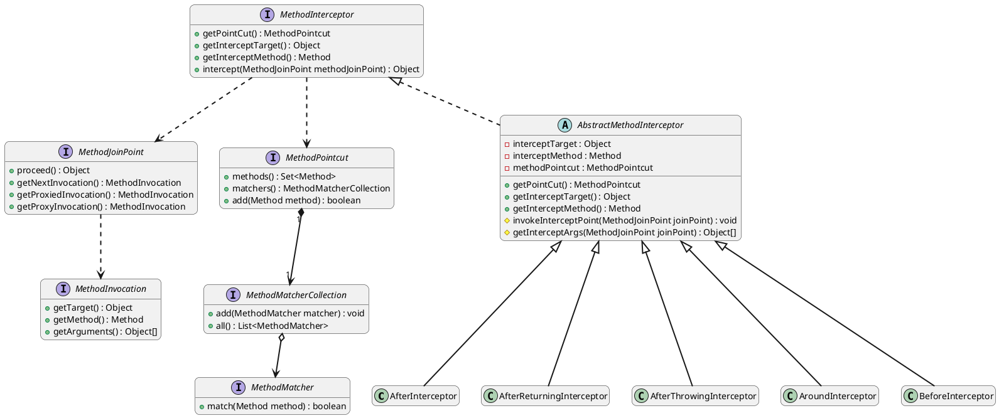
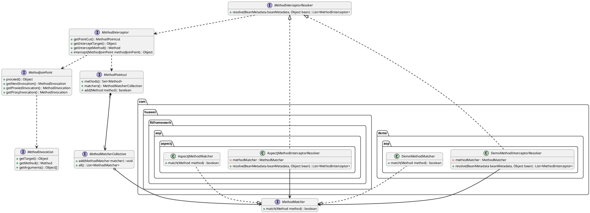
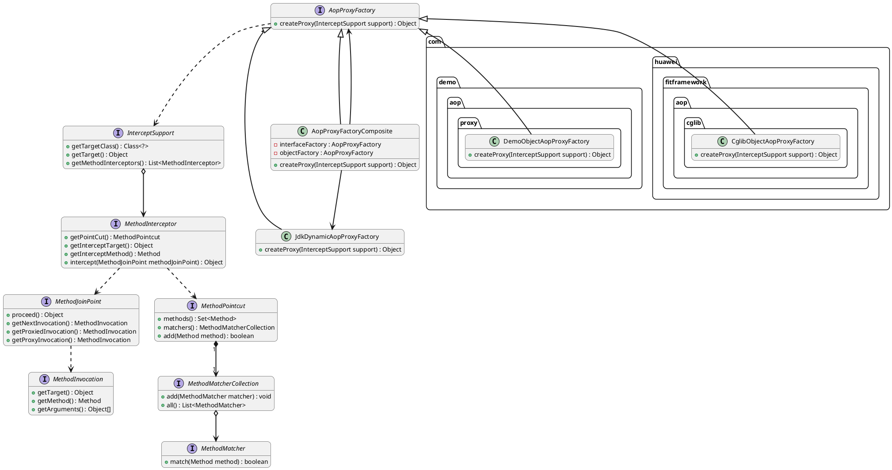

# Fit Aop 核心接口

## 方法拦截器 切面事件

```plantuml
@startuml
skinparam roundcorner 15
skinparam sequenceArrowThickness 2
skinparam defaultFontName Mono

hide empty members

class AfterInterceptor
class AfterReturningInterceptor
class AfterThrowingInterceptor
class AroundInterceptor
class BeforeInterceptor
interface MethodInterceptor {
+ getPointCut() : MethodPointcut
+ getInterceptTarget() : Object
+ getInterceptMethod() : Method
+ intercept(MethodJoinPoint methodJoinPoint) : Object
}
interface MethodJoinPoint {
+ proceed() : Object
+ getNextInvocation() : MethodInvocation
+ getProxiedInvocation() : MethodInvocation
+ getProxyInvocation() : MethodInvocation
}
interface MethodInvocation {
+ getTarget() : Object
+ getMethod() : Method
+ getArguments() : Object[]
}
interface MethodMatcher {
+ match(Method method) : boolean
}
interface MethodPointcut {
+ methods() : Set<Method>
+ matchers() : MethodMatcherCollection
+ add(Method method) : boolean
}
interface MethodMatcherCollection {
+ add(MethodMatcher matcher) : void
+ all() : List<MethodMatcher>
}

abstract class AbstractMethodInterceptor {
- interceptTarget : Object
- interceptMethod : Method
- methodPointcut : MethodPointcut
+ getPointCut() : MethodPointcut
+ getInterceptTarget() : Object
+ getInterceptMethod() : Method
# invokeInterceptPoint(MethodJoinPoint joinPoint) : void
# getInterceptArgs(MethodJoinPoint joinPoint) : Object[]
}

MethodInterceptor <|.. AbstractMethodInterceptor
AbstractMethodInterceptor <|--- AfterInterceptor
AbstractMethodInterceptor <|--- AfterReturningInterceptor
AbstractMethodInterceptor <|--- AfterThrowingInterceptor
AbstractMethodInterceptor <|--- AroundInterceptor
AbstractMethodInterceptor <|--- BeforeInterceptor
MethodInterceptor ..> MethodPointcut
MethodInterceptor ..> MethodJoinPoint
MethodJoinPoint ..> MethodInvocation
MethodPointcut "1" *--> "1" MethodMatcherCollection
MethodMatcherCollection o--> MethodMatcher

@enduml
```

## 方法拦截器提供者 解析用户自定义切面事件

```plantuml
@startuml
skinparam roundcorner 15
skinparam sequenceArrowThickness 2
skinparam defaultFontName Mono

hide empty members

interface MethodInterceptor {
+ getPointCut() : MethodPointcut
+ getInterceptTarget() : Object
+ getInterceptMethod() : Method
+ intercept(MethodJoinPoint methodJoinPoint) : Object
}
interface MethodJoinPoint {
+ proceed() : Object
+ getNextInvocation() : MethodInvocation
+ getProxiedInvocation() : MethodInvocation
+ getProxyInvocation() : MethodInvocation
}
interface MethodInvocation {
+ getTarget() : Object
+ getMethod() : Method
+ getArguments() : Object[]
}
interface MethodMatcher {
+ match(Method method) : boolean
}
interface MethodPointcut {
+ methods() : Set<Method>
+ matchers() : MethodMatcherCollection
+ add(Method method) : boolean
}
interface MethodMatcherCollection {
+ add(MethodMatcher matcher) : void
+ all() : List<MethodMatcher>
}

interface MethodInterceptorResolver {
+ resolve(BeanMetadata beanMetadata, Object bean) : List<MethodInterceptor>
}
package com.huawei.fitframework.aop.aspectj {
  class AspectJMethodInterceptorResolver {
  - methodMatcher : MethodMatcher
  + resolve(BeanMetadata beanMetadata, Object bean) : List<MethodInterceptor>
  }
  class AspectJMethodMatcher {
  + match(Method method) : boolean
  }
}
package com.demo.aop {
  class DemoMethodInterceptorResolver {
  - methodMatcher : MethodMatcher
  + resolve(BeanMetadata beanMetadata, Object bean) : List<MethodInterceptor>
  }
  class DemoMethodMatcher {
  + match(Method method) : boolean
  }
}

MethodInterceptor ..> MethodPointcut
MethodInterceptor ..> MethodJoinPoint
MethodJoinPoint ..> MethodInvocation
MethodPointcut "1" *--> "1" MethodMatcherCollection
MethodMatcherCollection o--> MethodMatcher

MethodInterceptorResolver ..> MethodInterceptor
MethodInterceptorResolver <|.. AspectJMethodInterceptorResolver
MethodMatcher <|.. AspectJMethodMatcher
AspectJMethodInterceptorResolver --> MethodMatcher
MethodInterceptorResolver <|.. DemoMethodInterceptorResolver
MethodMatcher <|.. DemoMethodMatcher
DemoMethodInterceptorResolver --> MethodMatcher

@enduml
```

## AOP 代理创建

```plantuml
@startuml
skinparam roundcorner 15
skinparam sequenceArrowThickness 2
skinparam defaultFontName Mono

hide empty members

interface MethodInterceptor {
+ getPointCut() : MethodPointcut
+ getInterceptTarget() : Object
+ getInterceptMethod() : Method
+ intercept(MethodJoinPoint methodJoinPoint) : Object
}
interface MethodJoinPoint {
+ proceed() : Object
+ getNextInvocation() : MethodInvocation
+ getProxiedInvocation() : MethodInvocation
+ getProxyInvocation() : MethodInvocation
}
interface MethodInvocation {
+ getTarget() : Object
+ getMethod() : Method
+ getArguments() : Object[]
}
interface MethodMatcher {
+ match(Method method) : boolean
}
interface MethodPointcut {
+ methods() : Set<Method>
+ matchers() : MethodMatcherCollection
+ add(Method method) : boolean
}
interface MethodMatcherCollection {
+ add(MethodMatcher matcher) : void
+ all() : List<MethodMatcher>
}

interface AopProxyFactory {
+ createProxy(InterceptSupport support) : Object
}
interface InterceptSupport {
+ getTargetClass() : Class<?>
+ getTarget() : Object
+ getMethodInterceptors() : List<MethodInterceptor>
}
class JdkDynamicAopProxyFactory {
+ createProxy(InterceptSupport support) : Object
}
class AopProxyFactoryComposite {
- interfaceFactory : AopProxyFactory
- objectFactory : AopProxyFactory
+ createProxy(InterceptSupport support) : Object
}
package com.huawei.fitframework.aop.cglib {
  class CglibObjectAopProxyFactory {
  + createProxy(InterceptSupport support) : Object
  }
}
package com.demo.aop.proxy {
  class DemoObjectAopProxyFactory {
  + createProxy(InterceptSupport support) : Object
  }
}

MethodInterceptor ..> MethodPointcut
MethodInterceptor ..> MethodJoinPoint
MethodJoinPoint ..> MethodInvocation
MethodPointcut "1" *--> "1" MethodMatcherCollection
MethodMatcherCollection o--> MethodMatcher

AopProxyFactory <|-- AopProxyFactoryComposite
AopProxyFactory <|-- JdkDynamicAopProxyFactory
AopProxyFactory ..> InterceptSupport
InterceptSupport o--> MethodInterceptor
AopProxyFactoryComposite --> AopProxyFactory
AopProxyFactoryComposite --> JdkDynamicAopProxyFactory

AopProxyFactory <|-- CglibObjectAopProxyFactory
AopProxyFactory <|-- DemoObjectAopProxyFactory

@enduml
```