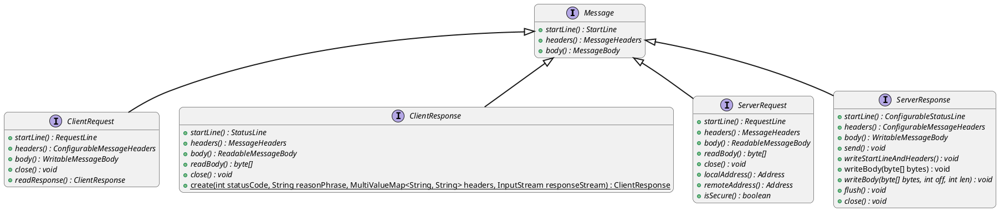
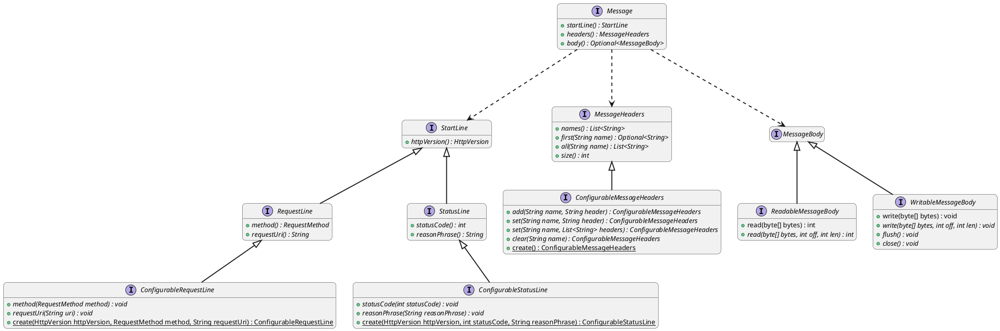

# Http Low Level Messages

```plantuml
@startuml
skinparam roundcorner 15
skinparam sequenceArrowThickness 2
skinparam defaultFontName Mono

hide empty members

interface Message {
+ {abstract} startLine() : StartLine
+ {abstract} headers() : MessageHeaders
+ {abstract} body() : MessageBody
}
interface ClientRequest {
+ {abstract} startLine() : RequestLine
+ {abstract} headers() : ConfigurableMessageHeaders
+ {abstract} body() : WritableMessageBody
+ {abstract} close() : void
+ {abstract} readResponse() : ClientResponse
}
interface ClientResponse {
+ {abstract} startLine() : StatusLine
+ {abstract} headers() : MessageHeaders
+ {abstract} body() : ReadableMessageBody
+ {abstract} readBody() : byte[]
+ {abstract} close() : void
+ {static} create(int statusCode, String reasonPhrase, MultiValueMap<String, String> headers, InputStream responseStream) : ClientResponse
}
interface ServerRequest {
+ {abstract} startLine() : RequestLine
+ {abstract} headers() : MessageHeaders
+ {abstract} body() : ReadableMessageBody
+ {abstract} readBody() : byte[]
+ {abstract} close() : void
+ {abstract} localAddress() : Address
+ {abstract} remoteAddress() : Address
+ {abstract} isSecure() : boolean
}
interface ServerResponse {
+ {abstract} startLine() : ConfigurableStatusLine
+ {abstract} headers() : ConfigurableMessageHeaders
+ {abstract} body() : WritableMessageBody
+ {abstract} send() : void
+ {abstract} writeStartLineAndHeaders() : void
+ writeBody(byte[] bytes) : void
+ {abstract} writeBody(byte[] bytes, int off, int len) : void
+ {abstract} flush() : void
+ {abstract} close() : void
}

Message <|-- ClientRequest
Message <|-- ClientResponse
Message <|-- ServerRequest
Message <|-- ServerResponse

@enduml
```

# Http Protocol

```plantuml
@startuml
skinparam roundcorner 15
skinparam sequenceArrowThickness 2
skinparam defaultFontName Mono

hide empty members

interface Message {
+ {abstract} startLine() : StartLine
+ {abstract} headers() : MessageHeaders
+ {abstract} body() : Optional<MessageBody>
}

interface StartLine {
+ {abstract} httpVersion() : HttpVersion
}
interface RequestLine {
+ {abstract} method() : RequestMethod
+ {abstract} requestUri() : String
}
interface ConfigurableRequestLine {
+ {abstract} method(RequestMethod method) : void
+ {abstract} requestUri(String uri) : void
+ {static} create(HttpVersion httpVersion, RequestMethod method, String requestUri) : ConfigurableRequestLine
}
interface StatusLine {
+ {abstract} statusCode() : int
+ {abstract} reasonPhrase() : String
}
interface ConfigurableStatusLine {
+ {abstract} statusCode(int statusCode) : void
+ {abstract} reasonPhrase(String reasonPhrase) : void
+ {static} create(HttpVersion httpVersion, int statusCode, String reasonPhrase) : ConfigurableStatusLine
}

interface MessageHeaders {
+ {abstract} names() : List<String>
+ {abstract} first(String name) : Optional<String>
+ {abstract} all(String name) : List<String>
+ {abstract} size() : int
}
interface ConfigurableMessageHeaders {
+ {abstract} add(String name, String header) : ConfigurableMessageHeaders
+ {abstract} set(String name, String header) : ConfigurableMessageHeaders
+ {abstract} set(String name, List<String> headers) : ConfigurableMessageHeaders
+ {abstract} clear(String name) : ConfigurableMessageHeaders
+ {static} create() : ConfigurableMessageHeaders
}

interface MessageBody {}
interface ReadableMessageBody {
+ read(byte[] bytes) : int
+ {abstract} read(byte[] bytes, int off, int len) : int
}
interface WritableMessageBody {
+ write(byte[] bytes) : void
+ {abstract} write(byte[] bytes, int off, int len) : void
+ {abstract} flush() : void
+ {abstract} close() : void
}

StartLine <|-- RequestLine
RequestLine <|-- ConfigurableRequestLine
StartLine <|-- StatusLine
StatusLine <|-- ConfigurableStatusLine

MessageHeaders <|-- ConfigurableMessageHeaders

MessageBody <|-- ReadableMessageBody
MessageBody <|-- WritableMessageBody

Message ...> StartLine
Message ...> MessageHeaders
Message ...> MessageBody

@enduml
```