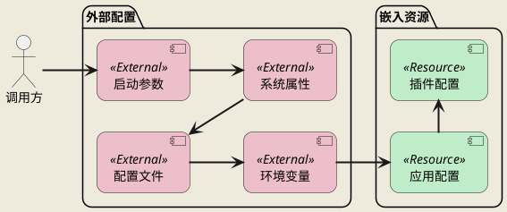
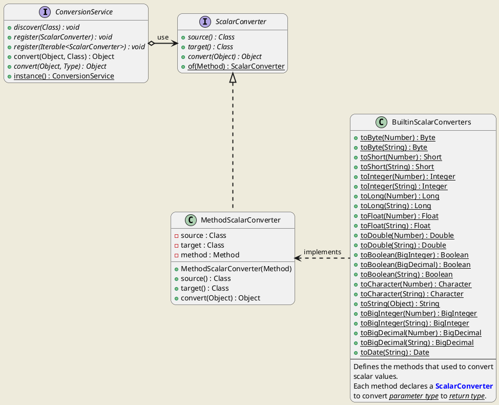
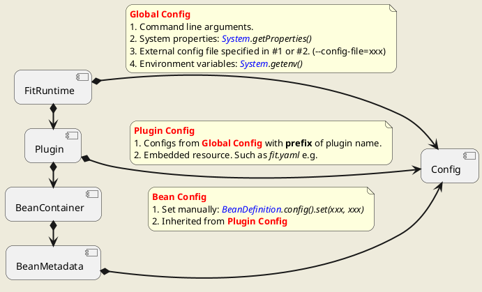
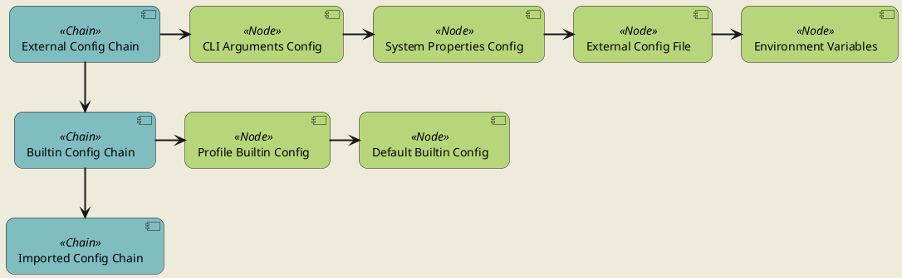
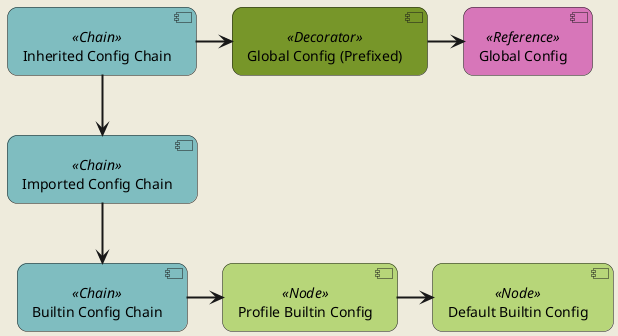
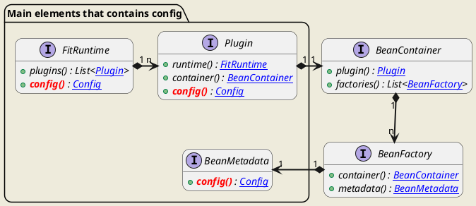

<div style="text-align: center;"><span style="font-size: 40px"><b>FIT 配置架构设计</b></span></div>

[TOC]

# 配置优先级

配置的优先级原则为**外部配置**的优先级大于**内部配置**的优先级。即外部配置更优先被使用，只有当外部配置不存在时，才使用内部配置（默认配置）。



命令行参数 > 环境变量 > 插件配置文件 > 框架配置文件 > 插件资源文件 > 框架资源文件。

# 架构设计

## 核心类图

```plantuml
@startuml
hide empty members

skinparam backgroundColor #EEEBDC
skinparam roundcorner 20
skinparam sequenceArrowThickness 2
skinparam ClassFontName Consolas

interface Config {
+ {abstract} name() : String
+ {abstract} keys() : Set<String>
+ {abstract} get(String key) : Object
+ {abstract} get(String key, Type type) : Object
+ {abstract} get(String key, Class<T> clazz) : T
+ {abstract} decrypt(ConfigDecryptor decryptor) : void
+ list(String key, Class<T> elementClass) : List<T>
--
Provide a config that is <b>readonly</b>. <color:blue><b>ModifiableConfig</b></color>
should be used when the value of config can be changed.
}
note right of Config::name()
The name of a <color:blue><b>Config</b></color> is non-functional. It
provides an identifier for <b>distinguishing</b> and
<b>marking</b> in terms of debugging and logs.
end note

interface ModifiableConfig {
+ {abstract} set(String key, Object value) : void
+ {abstract} subscribe(<color:blue><u>ModifiableConfigListener</u></color> listener) : void
+ {abstract} unsubscribe(<color:blue><u>ModifiableConfigListener</u></color> listener) : void
--
Provide a config that can be modified. <color:blue><b>Config</b></color> should
be used if it is <b>NOT</b> modifiable.
}
ModifiableConfig --up--|> Config

interface ModifiableConfigListener {
+ onValueChanged(<color:blue><u>ModifiableConfig</u></color> config, String key) : void
--
<color:red><b>Observer Pattern</b></color>
Provide a listener for <color:blue><b>ModifiableConfig</b></color>. The listener will
be notified with the specified key when the value is
changed.
}
ModifiableConfigListener .left.> ModifiableConfig : listen

interface ConfigChain {
+ {abstract} addConfig(<color:blue><u>Config</u></color> config) : void
+ {abstract} insertConfig(int index, <color:blue><u>Config</u></color> config) : void
+ {abstract} addConfigs(<color:blue><u>Config</u></color>... configs) : void
+ {abstract} removeConfig(<color:blue><u>Config</u></color>) : void
+ {abstract} clear() : void
+ {abstract} numberOfConfigs() : int
+ {abstract} configAt(int index) : <color:blue><u>Config</u></color>
+ {abstract} subscribe(<color:blue><u>ConfigChainListener</u></color> listener) : void
+ {abstract} unsubscribe(<color:blue><u>ConfigChainListener</u></color> listener) : void
--
<color:red><b>Composite Pattern</b></color>
Provide a composite for <color:blue><b>Config</b></color> to present
multiple instances as one.
<color:red><b>Chain of Responsibility Pattern</b></color>
When any key is accessed, the retrieval starts
from the head of the chain and ends when the
value is found. The remaining <color:blue><b>Config</b></color>s will not
be accessed. 
}
ConfigChain -right--|> Config
ConfigChain *-down--> Config

interface ConfigChainListener {
+ onConfigAdded(<color:blue><u>ConfigChain</u></color> chain, <color:blue><u>Config</u></color> config) : void
+ onConfigRemoved(<color:blue><u>ConfigChain</u></color> chain, <color:blue><u>Config</u></color> config) : void
+ onConfigChanged(<color:blue><u>ConfigChain</u></color> chain, <color:blue><u>ModifiableConfig</u></color> config, String key) : void
--
<color:red><b>Observer Pattern</b></color>
Provide a listener for <color:blue><b>ConfigChain</b></color>. The listener will be notified when
<color:blue><b>Config</b></color> is added to or removed from the chain, or values in <color:blue><b>Config</b></color> is
changed.
}
ConfigChainListener .right.> ConfigChain : listen

interface ConfigLoadingResult {
+ {abstract} loaded() : boolean
+ {abstract} config() : <color:blue><u>Config</u></color>
+ {static} success(<color:blue><u>Config</u></color> config) : <color:blue><u>ConfigLoadingResult</u></color>
+ {static} failure() : <color:blue><u>ConfigLoadingResult</u></color>
}

interface ConfigLoader {
+ {abstract} extensions() : Set<String>
+ load(Resource resource) : <color:blue><u>ConfigLoadingResult</u></color>
+ {abstract} load(Resource resource, String name) : <color:blue><u>ConfigLoadingResult</u></color>
+ {static} empty() : <color:blue><u>ConfigLoader</u></color>
+ {static} loadConfig(<color:blue><u>ConfigLoader</u></color> loader, Resource resource) : <color:blue><u>Config</u></color>
+ {static} loadConfig(<color:blue><u>ConfigLoader</u></color> loader, Resource resource, String name) : <color:blue><u>Config</u></color>
--
Provide methods to load <color:blue><b>Config</b></color> from resources.
<color:red><b>Extensibility</b></color>: Java <color:blue>ServiceLoader</color> mechanism.
}
ConfigLoader .right.> ConfigLoadingResult : return
ConfigLoader .down.> Config : load

interface ConfigLoaderChain {
+ {abstract} addLoader(<color:blue><u>ConfigLoader</u></color> loader) : void
+ {abstract} removeLoader(<color:blue><u>ConfigLoader</u></color> loader) : void
+ {abstract} numberOfLoaders() : int
+ {abstract} loaderAt(int index) : <color:blue><u>ConfigLoader</u></color>
+ {abstract} subscribe(<color:blue><u>ConfigLoaderChainListener</u></color> listener) : void
+ {abstract} unsubscribe(<color:blue><u>ConfigLoaderChainListener</u></color> listener) : void
+ {static} createDefault() : <color:blue><u>ConfigLoaderChain</u></color>
--
<color:red><b>Composite Pattern</b></color>
Provide a composite for <color:blue><b>ConfigLoader</b></color> to present
multiple instances as one.
<color:red><b>Chain of Responsibility Pattern</b></color>
When any key is accessed, the retrieval starts from
the head of the chain and ends when the value is
found. The remaining <color:blue><b>ConfigLoader</b></color>s will not be
accessed. 
}
ConfigLoaderChain -right-|> ConfigLoader

interface ConfigLoaderChainListener {
+ onConfigLoaderAdded(<color:blue><u>ConfigLoaderChain</u></color> chain, <color:blue><u>ConfigLoader</u></color> loader) : void
+ onConfigLoaderRemoved(<color:blue><u>ConfigLoaderChain</u></color> chain, <color:blue><u>ConfigLoader</u></color> loader) : void
--
<color:red><b>Observer Pattern</b></color>
Provide a listener for <color:blue><b>ConfigLoaderChain</b></color>. The listener will be notified
when <color:blue><b>ConfigLoader</b></color> is added to or removed from the chain.
}
ConfigLoaderChainListener .right.> ConfigLoaderChain : listen

abstract AbstractConfig {
- name : String
--
+ AbstractConfig(String name)
+ name() : String
+ get(String key, Type type) : Object
+ get(String key, Class<T> clazz) : T
+ toString() : String
--
Provide an abstract base
implementation for the <color:blue><b>Config</b></color>.
Support to convert type of values.
}
AbstractConfig ..up..|> Config

AbstractConfig -[hidden]> ModifiableConfig

class DefaultConfigChain {
- configs : List<<color:blue><u>Config</u></color>>
- listeners : List<<color:blue><u>ConfigChainListener</u></color>>
- configListener : ConfigListener
..
- currentConfigs : List<<color:blue><u>Config</u></color>>
- currentListeners : List<<color:blue><u>ConfigChainListener</u></color>>
--
+ DefaultConfigChain(String name)
+ Set<String> keys()
+ Object get(String key)
+ decrypt(ConfigDecryptor decryptor) : void
+ int addConfig(<color:blue><u>Config</u></color> config)
+ void insertConfig(int index, <color:blue><u>Config</u></color> config)
+ void addConfigs(<color:blue><u>Config</u></color>... configs)
+ void removeConfig(<color:blue><u>Config</u></color> config)
+ void clear()
+ int numberOfConfigs()
+ <color:blue><u>Config</u></color> configAt(int index)
+ void subscribe(<color:blue><u>ConfigChainListener</u></color> listener)
+ void unsubscribe(<color:blue><u>ConfigChainListener</u></color> listener)
# void notifyConfigAdded(<color:blue><u>Config</u></color> config)
# void notifyConfigRemoved(<color:blue><u>Config</u></color> config)
# void notifyConfigChanged(<color:blue><u>ModifiableConfig</u></color> config, String key)
}
DefaultConfigChain .up.> ConfigChain
DefaultConfigChain -down-|> AbstractConfig

abstract AbstractModifiableConfig {
- listeners : List<<color:blue><u>ModifiableConfigListener</u></color>>
--
+ AbstractModifiableConfig(String name)
+ subscribe(<color:blue><u>ModifiableConfigListener</u></color> listener) : void
+ unsubscribe(<color:blue><u>ModifiableConfigListener</u></color> listener) : void
+ decrypt(ConfigDecryptor decryptor) : void
# notifyValueChanged(String key) : void
--
Provide a abstract base implementation for the
<color:blue><b>ModifiableConfig</b></color>.
Support to subscribe and unsubscribe listeners.
}
AbstractModifiableConfig -up-|> AbstractConfig
AbstractModifiableConfig .up.|> ModifiableConfig

class MapConfig {
- map : Map<String, Object>
--
+ MapConfig(String name, Map<String, ?> map)
+ keys() : Set<String>
+ get(String key) : Object
+ set(String key, Object value) : void
--
Provide an implementation of
<color:blue><b>ModifiableConfig</b></color> which values is stored in
a map.
}
MapConfig -up-|> AbstractModifiableConfig

class HierarchicalConfig {
- values : Map<String, Object>
--
+ HierarchicalConfig(String name)
+ HierarchicalConfig(String name, Map<?, ?> values)
+ keys() : Set<String>
+ get(String key) : Object
+ set(String key, Object value) : void
--
Provide an implementation of <color:blue><b>ModifiableConfig</b></color>
which values is stored in a hierarchical map. The
key will be separated into a path by the <b>separator</b>.
The value to set or get will be retrieved
recursively in the hierarchical map.
}
HierarchicalConfig -up-|> AbstractModifiableConfig

class PropertiesConfig {
- properties : Properties
--
+ PropertiesConfig(String name, Properties properties)
+ keys() : Set<String>
+ get(String key) : Object
+ set(String key, Object value) : void
--
Provide an implementation of <color:blue><b>ModifiableConfig</b></color> which
values is stored in a property set.
}
PropertiesConfig -up-|> AbstractModifiableConfig

class ReadonlyPropertiesConfig {
- properties : Properties
--
+ ReadonlyPropertiesConfig(String name, Properties properties)
+ keys() : Set<String>
+ get(String key) : Object
+ decrypt(ConfigDecryptor decryptor) : void
--
Provide an implementation of <color:blue><b>Config</b></color> which values is stored in
a property set.
}
ReadonlyPropertiesConfig -up-|> AbstractConfig

class ReadonlyMapConfig {
- map : Map<String, Object>
--
+ ReadonlyMapConfig(Map<String, Object> map)
+ ReadonlyMapConfig(String name, Map<String, ?> map)
+ keys() : Set<String>
+ get(String key) : Object
+ decrypt(ConfigDecryptor decryptor) : void
--
Provide an implementation of <color:blue><b>Config</b></color> which values is
stored in a map.
}
ReadonlyMapConfig -up-|> AbstractConfig
@enduml
```


## 配置的值

### 值的类型

- 标量（scalar），表示一个具体的值，如一个整数、字符串等。
  - 整数：`java.math.BigInteger`
  - 实数：`java.math.BigDecimal`
  - 布尔值：`java.lang.Boolean`
  - 字符串：`java.lang.String`
  - 日期时间：`java.util.Date`
- 列表（`java.util.List<Object>`），表示一系列有序的值，如列表或数组等。
- 对象（`java.util.Map<String, Object>`），表示`key=value`风格的属性与值的集合。

当通过`Config`接口的`get(String)`方法获取的配置中指定键的值时，仅会返回`null`或以上类型的实例。

#### 类型转换



<b><u>Support</u></b>

| | byte | short | int | long | float | double | boolean | char | String | BigInteger | BigDecimal | Date |
|---|---|---|---|---|---|---|---|---|---|---|---|---|
| BigInteger | Y | Y | Y | Y | Y | Y | Y | Y | Y | Y | Y | Y |
| BigDecimal | Y | Y | Y | Y | Y | Y | Y | Y | Y | Y | Y | Y |
| Boolean | N | N | N | N | N | N | Y | N | Y | N | N | N |
| String | Y | Y | Y | Y | Y | Y | Y | Y | Y | Y | Y | Y |
| Date | N | N | N | N | N | N | N | N | Y | N | N | Y |

### 值的合并

<table>
  <tr>
    <th></th>
    <th>标量</th>
    <th>列表</th>
    <th>对象</th>
  </tr>
  <tr>
    <th>标量</th>
    <td>列表，包含两个标量</td>
    <td>列表，包含标量及列表中的所有值</td>
    <td><font color="red">不支持</font></td>
  </tr>
  <tr>
    <th>列表</th>
    <td>列表，包含标量及列表中的所有值</td>
    <td>列表，包含两个列表中的所有值</td>
    <td><font color="red">不支持</font></td>
  </tr>
  <tr>
    <th>对象</th>
    <td><font color="red">不支持</font></td>
    <td><font color="red">不支持</font></td>
    <td>对象，包含两个对象中的所有属性</td>
  </tr>
</table>

> **为什么不能将对象与标量的处理方式保持一致？**
>
> 配置的形态是层次化的，即是一个树形结构，这个树形结构既是通过**对象**类型的值构建而成。例如，当配置中包含以下内容时：
> - server.name=demo
> - server.type=http
> - server.port=8088
>
> 此时配置的实际结构如下所示（`yaml`格式）：
> ```yaml
> server:
>   name: demo
>   type: http
>   port: 8088
> ```
>
> 此时若将**对象**与**标量**合并形成一个列表，会影响配置的实际结构，因此不能将二者合并。

## 使用方


配置的分层：
- Global Config
- Plugin Config
- Bean Config

### Global Config


- Command Line Arguments Config，从命令行中解析`key=value`风格的输入。其中`key`可以添加`--`前缀，其与无前缀时的含义是一样的。即`--config-file=xxx`与`config-file=xxx`的含义是一样的。
- System Properties Config，直接通过`System.getProperties()`所获取的系统属性生成配置。
- External Config File，从指定的配置文件中解析配置。配置文件的路径通过`config-file`指定。
- Environment Variables，直接通过`System.getenv()`所获取的环境变量生成配置。

### Plugin Config

```plantuml
@startuml
hide empty members

skinparam backgroundColor #EEEBDC
skinparam roundcorner 20
skinparam sequenceArrowThickness 2
skinparam ClassFontName Consolas

left to right direction

skinparam component {
  BackgroundColor<<Input>> Pink
  BackgroundColor<<Client>> #7FBDC0
  BackgroundColor<<Class>> #B7D679
  BackgroundColor<<Virtual>> white
}

skinparam package {
  BackgroundColor<<Composite>> lightgray
}

component FitRuntime as FR <<Client>>

package "Global Config" as GC <<Composite>> {
component "Command Line" as CLI <<Input>>
component PropertiesConfig as CLIPC <<Class>>
FR -down-> CLI
CLI -down-> CLIPC

component "System Properties" as SP <<Input>>
component MapConfig as SPMC <<Class>>
FR -down-> SP
SP -down-> SPMC
SP -[hidden]> CLI

component "External File" as EF <<Input>>
component HierarchicalMapConfig as EFHMC <<Class>>
FR -down-> EF
EF -down-> EFHMC
EF -[hidden]> SP

component "Environment Variables" as EV <<Input>>
component MapConfig as EVMC <<Class>>
FR -down-> EV
EV -down-> EVMC
EV -[hidden]> EF

component "Embedded Resource" as ER <<Input>>
component HierarchicalMapConfig as ERHMC <<Class>>
FR -down-> ER
ER -[hidden]> EV
component "Builtin Resource (Default)" as BER <<Input>>
component "Builtin Resource (Profile)" as PAER <<Input>>
component "Annotated Import Resource" as AIER <<Input>>
BER -[hidden]> PAER
AIER -[hidden]> BER
ER -down-> BER
ER -down-> PAER
ER -down-> AIER
BER -down-> ERHMC
PAER -down-> ERHMC
AIER -down-> ERHMC
}

component Plugin as P <<Client>>
FR -right-> P

component "Visit with prefix\n(<i>Key of plugin</i>)" as PVC <<Virtual>> #line.dashed

component "Embedded Resource" as PER <<Input>>
component HierarchicalMapConfig as PERHMC <<Class>>
P -down-> PER
PER -down-> PERHMC

component BeanMetadata as BM <<Client>>
P -right-> BM

component "Custom Properties" as BMCP <<Input>>
component MapConfig as BMCPMC <<Class>>
BM -down-> BMCP
BMCP -down-> BMCPMC

PVC .left.> GC
PER .left.> PVC : inherit
BMCP .left.> PER : inherit
@enduml
```





