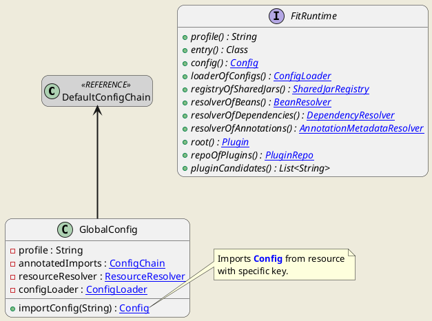
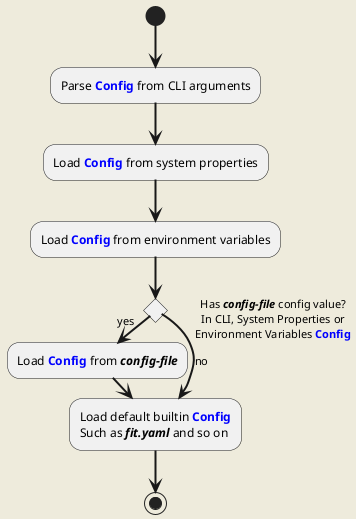

<div style="text-align: center;"><span style="font-size: 40px"><b>FIT运行时</b></span></div>

[TOC]

# 运行时形态

## 公共软件包

用户通过FIT所提供的软件包，将FIT运行时安装在操作系统中，并通过FIT所提供的命令行启动FIT运行时。

此时操作系统中存在`FIT_HOME`目录，并将其中的`bin`目录配置到`Path`环境变量，此时可通过`fit`命令启动FIT应用程序。

## All In One

> 待补充

# 类加载程序

## 整体思路

在一个FIT应用中，所运行的组件有FIT框架和FIT插件。为了确保各组件间的类隔离，FIT框架与各个插件均使用独立的`ClassLoader`，从而达到三方包不冲突的目标。

但其中，FIT框架与各个插件可能通过`Genericable`进行通信，例如在某个插件中实现了`Fitable`，并在FIT框架或其他插件中通过`Genericable`进行调用，此时即需要这些`Genericable`在FIT框架与所有插件中呈现为同一个类，因此需要在同一个`ClassLoader`中被加载。

同时，FIT框架为插件实现提供了诸多API与工具方法，分别承载在`fit-api`和`fit-util`中，也需要被FIT框架及所有插件同时使用。

因此类加载程序的整体思路如下图所示。


其中：
- `SharedClassLoader`，用以加载`fit-api`、`fit-util`及所有的`Genericable`定义，被FIT框架及所有插件使用。
- `FrameworkClassLoader`，其双亲委派到`SharedClassLoader`，用以加载FIT框架。
- `PluginClassLoader`，双亲委派到`SharedClassloader`，用以加载FIT插件，每个插件拥有独立的`PluginClassLoader`实例。

通过这样的实现，使FIT框架与所有插件使用相同的`fit-api`、`fit-util`及`Genericable`定义。而FIT框架与各插件均使用各自的`Class Loader`，从而达到类隔离的目标。

## 场景差异

为了实现上述的目标和结构，需要由FIT控制`ClassLoader`的创建过程，从而构建出所需的结构。

在直接启动一个FIT应用时，这个目标是很容易实现的。FIT应用通过`fit-launcher`模块启动`fit-runtime`，FIT框架的整体架构由`fit-runtime`承载并提供入口。此时整体的`ClassLoader`由`fit-launcher`创建并构建预期结构，并通过`FrameworkClassLoader`创建`FitRuntime`实例，进而加载并启动整个应用程序。

但是当用户直接编写`main`方法，并以此启动应用时，用户会在所编写的`main`方法中启动`FitRuntime`，`FitRuntime`会由`AppClassLoader`加载，其中会包含`fit-api`、`fit-util`以及FIT框架所使用到的`Genericable`，此时无法修改`AppClassLoader`的上层类加载程序并将公共包转移到其中，因此需要有特殊的手段来解决这个问题。

综上，`ClassLoader`的结构因实际情况而形成两个场景。

### 场景一：`fit-launcher`创建期望`ClassLoader`结构，并由`FrameworkClassLoader`加载`FitRuntime`

在此场景中，`fit-launcher`基于`AppClassLoader`创建`SharedClassLoader`，加载`fit-api`、`fit-util`及其他公共包，并提供后续的包注册能力。 之后`fit-launcher`再基于`SharedClassLoader`创建`FrameworkClassLoader`。

此时类加载程序的结构如下图。


### 场景二：`AppClassLoader`直接加载`FitRuntime`

在该场景下，`FrameworkClassLoader`直接使用`AppClassLoader`，其中包含`fit-api`、`fit-util`、框架实现、用户主插件实现及框架与主插件中使用到的所有`Genericable`。

> 此时用户主插件与FIT框架在同在`FrameworkClassLoader`，需要由用户解决三方包冲突问题。

为了避免框架与用户主插件，与其他插件产生的类冲突，需要额外基于`FrameworkClassLoader`的上层类加载程序创建`SharedClassLoader`，其包含`FrameworkClassLoader`的引用，并将`fit-api`、`fit-util`及所有`Genericable`托管到`FrameworkClassLoader`。

> 托管方式为，重写`SharedClassLoader`的`loadClass`方法，当所需加载的类型为`fit-api`、`fit-util`或`FrameworkClassLoader`存在的`Genericable`时，直接从`FrameworkClassLoader`中获取对应类型，并返回给调用方。

此时类加载程序的结构图如下：


# 应用程序配置

## 运行时配置优先级


## 框架配置





# 核心类图

```plantuml
hide empty members

skinparam backgroundColor #EEEBDC
skinparam roundcorner 20
skinparam sequenceArrowThickness 2
skinparam ClassFontName Consolas

interface FitRuntime {
+ {abstract} location() : URL
+ {abstract} entry() : Class
+ {abstract} config() : <color:blue><u>Config</u></color>
+ {abstract} root() : <color:blue><u>Plugin</u></color>
+ {abstract} plugins() : List<<color:blue><u>Plugin</u></color>>
+ {abstract} resources() : <color:blue><u>ResourceTree</u></color>
.. <color:red><b>Components</b></color> ..
+ {abstract} sharedClassLoader() : ClassLoader
+ {abstract} registryOfSharedJars() : <color:blue><u>SharedJarRegistry</u></color>
+ {abstract} loaderOfConfigs() : <color:blue><u>ConfigLoader</u></color>
+ {abstract} resolverOfBeans() : <color:blue><u>BeanResolver</u></color>
+ {abstract} resolverOfDependencies() : <color:blue><u>DependencyResolver</u></color>
+ {abstract} resolverOfAnnotations() : <color:blue><u>AnnotationMetadataResolver</u></color>
+ {abstract} publisherOfEvents() : <color:blue><u>EventPublisher</u></color>
.. <color:red><b>Environment</b></color> ..
+ {abstract} profile() : String
.. <color:red><b>Operations</b></color> ..
+ {abstract} started() : boolean
+ {abstract} start() : void
}
note left of FitRuntime::"entry()"
The entry class of the runtime. Only
active when a main plugin exists.
end note
note left of FitRuntime::"config()"
The global config of the runtime. It
will be loaded from CLI arguments,
system properties, external config
file and environment variables.
end note
note left of FitRuntime::"root()"
The root plugin of the runtime. It
will always be the FIT framework.
end note

interface Plugin {
+ {abstract} metadata() : <color:blue><u>PluginMetadata</u></color>
+ {abstract} config() : <color:blue><u>PluginConfig</u></color>
+ {abstract} pluginClassLoader() : ClassLoader
+ {abstract} runtime() : <color:blue><u>FitRuntime</u></color>
+ {abstract} resources() : <color:blue><u>ResourceTree</u></color>
+ {abstract} parent() : <color:blue><u>Plugin</u></color>
+ {abstract} children() : <color:blue><u>PluginCollection</u></color>
.. <color:red><b>Components</b></color> ..
+ {abstract} resolverOfResources() : <color:blue><u>ResourceResolver</u></color>
+ {abstract} publisherOfEvents() : <color:blue><u>EventPublisher</u></color>
+ {abstract} container() : <color:blue><u>BeanContainer</u></color>
+ {abstract} sr() : <color:blue><u>StringResource</u></color>
.. <color:red><b>Operations</b></color> ..
+ {abstract} started() : boolean
+ {abstract} start() : void
--
A plugin <b>MUST</b> be packaged as a <b>JAR</b>.
}
FitRuntime *-right-> Plugin : has

interface PluginMetadata {
+ {abstract} group() : String
+ {abstract} name() : String
+ {abstract} version() : String
+ {abstract} location() : URL
+ {abstract} category() : <color:blue><u>PluginCategory</u></color>
+ {abstract} level() : int
}
Plugin o.up.> PluginMetadata
```

| Scenario | Location of FitRuntime (relative of fit-runtime) |
|---|---|
| All In One | ../../ |
| Software Package | ../ |

## RootPlugin

### All In One


- `SharedClassLoader`
- `FrameworkClassLoader`
- `PluginClassLoader`