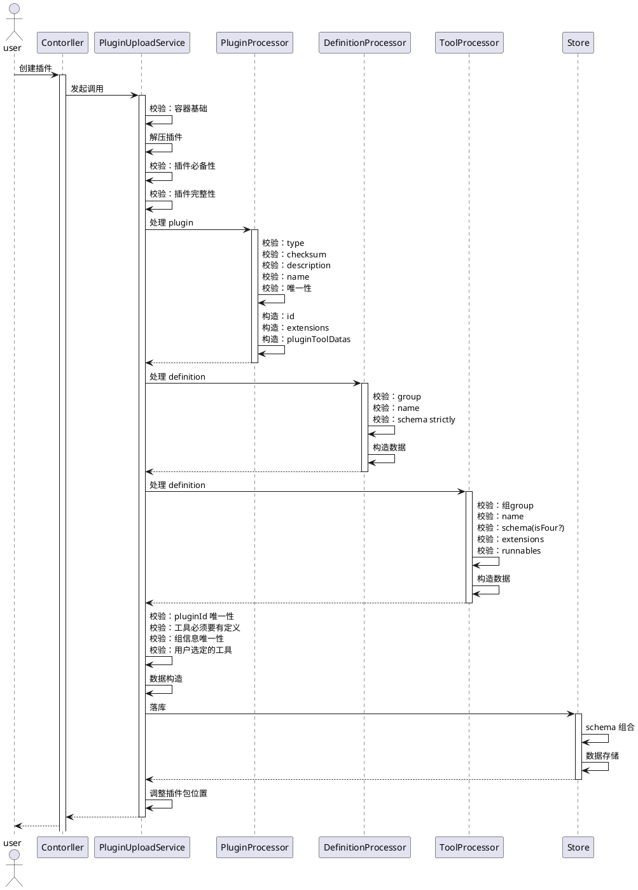
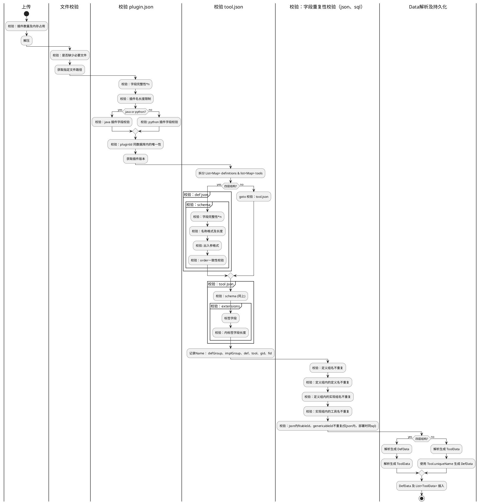

解析时序图

```plantuml
@startuml
actor user
participant "Contorller" as controller
participant "PluginUploadService" as service
participant "PluginProcessor" as pluginProcessor
participant "DefinitionProcessor" as defProcessor
participant "ToolProcessor" as toolProcessor
participant "Store" as store

user -> controller: 创建插件
activate controller
controller -> service: 发起调用
activate service
service -> service: 校验：容器基础
service -> service: 解压插件
service -> service: 校验：插件必备性
service -> service: 校验：插件完整性
service -> pluginProcessor: 处理 plugin
activate pluginProcessor
pluginProcessor -> pluginProcessor: 校验：type\n校验：checksum\n校验：description\n校验：name\n校验：唯一性
pluginProcessor -> pluginProcessor: 构造：id\n构造：extensions\n构造：pluginToolDatas
pluginProcessor --> service
deactivate pluginProcessor
service -> defProcessor: 处理 definition
activate defProcessor
defProcessor -> defProcessor: 校验：group\n校验：name\n校验：schema strictly
defProcessor -> defProcessor: 构造数据
defProcessor --> service
deactivate defProcessor
service -> toolProcessor: 处理 definition
activate toolProcessor
toolProcessor -> toolProcessor: 校验：组group\n校验：name\n校验：schema(isFour?)\n校验：extensions\n校验：runnables
toolProcessor -> toolProcessor: 构造数据
toolProcessor --> service
deactivate toolProcessor
service -> service: 校验：pluginId 唯一性\n校验：工具必须要有定义\n校验：组信息唯一性\n校验：用户选定的工具
service -> service: 数据构造
service -> store: 落库
activate store
store -> store: schema 组合
store -> store: 数据存储
store --> service 
deactivate store
service -> service: 调整插件包位置
service --> controller
deactivate service
controller --> user
deactivate user
@enduml
```
解析活动图

```plantuml
@startuml
|上传|
start
:校验：插件数量及内存占用;
:解压;
|文件校验|
:校验：是否缺少必要文件;
:获取指定文件路径;
|校验 plugin.json|
:校验：字段完整性*n;
:校验：插件名长度限制;
if (java or python?) then (yes)
    : 校验：java 插件字段校验;
else (no)
    : 校验: python 插件字段校验;
endif
: 校验：pluginId 同数据库内的唯一性;
: 获取插件版本;
|校验 tool.json|
:拆分 List<Map> definitions & list<Map> tools;
if (四层结构?) then (yes)
    partition "校验：def json" {
        partition "校验：schema" {
            :校验：字段完整性*n;
            :校验：名称格式及长度;
            :校验: 出入参格式;
            :校验：order一致性校验;
        }
    }
else (no)
    :goto 校验：tool.json;
endif
partition "校验：tool json" {
        :校验：schema (同上);
        partition "校验：extensions" {
            :标签字段;
            :校验：内标签字段长度;
        }
    }
:记录Name： defGroup、implGroup、def、tool、gid、fid;
|校验：字段重复性校验（json、sql）|
' 注意：旧版本的uuid作为定义信息等同sql校验;
:校验：定义组名不重复;
:校验：定义组内的定义名不重复;
:校验：定义组内的实现组名不重复;
:校验：实现组内的工具名不重复;
:校验：json内fitableId，genericableId不重复(仅json内，部署时同sql);
|Data解析及持久化|
if (四层结构?) then (yes)
    :解析生成 DefData;
    :解析生成 ToolData;
else (no)
    :解析生成 ToolData;
    :使用 Tool.uniqueName 生成 DefData;
endif
:DefData 及 List<ToolData> 插入;
stop
@enduml
```